# **KS4011 Keyestudio Micro:bit Honeycomb Smart Wearable Programmable Ultimate Kit**

 

# 1.Description:

Keyestudio Micro:bit Honeycomb Ultimate Kit, a wearable coding kit, is designed
to write code to control Keyestudio Micro:bit Honeycomb sensors/modules with
Micro:bit main board and via Microsoft's online graphical programming platform
Make Code. In the process of installing and controlling these sensors/modules,
there will be significant improvements in hand-making and code-writing
abilities.

MakeCode for micro:bit is the most popular graphical programming platform of
Micro:bit based on its open source graphical programming environment. It can be
shifted to python or javascript languages. The combination of program and
graphics make coding very easy. Meanwhile, it can also be simulated or
programmed to actual electronic components.

This kit consists of ED, buttons, a buzzer, an ambient light sensor, a joystick
and other sensors. With this kit, not only can you learn basic knowledge about
these sensors/modules but also you can use them to design circuits. With the
help of this kit, your circuits will be cooler. Now, let this Micro:bit Ultimate
kit lead you into the excellent world of electronics.

# 2.Kit List：

|         | BBC Micro:bit Main Board V2.0                              | 1       |             |
|         | Keyestudio Edge  Connector IO Breakout Board for Micro:bit | 1       |    |
|         | Keyestudio Micro:bit 1W LED Module                         | 1       |     |
|         | Keyestudio Micro:bit Digital LED Module                    | 1       |     |
|         | Keyestudio Micro:bit 5050RGB Module                        | 1       |     |
|         | Keyestudio Micro:bit Traffic Light Module                  | 1       |     |
|         | Keyestudio Micro:bit Passive Buzzer                        | 1       |     |
|         | Keyestudio Micro:bit Tactile Button Module                 | 1       |     |
|         | Keyestudio Micro:bit Vibration Tilt Module                 | 1       |     |
|         | Keyestudio Micro:bit Capacitive Touch Module               | 1       |     |
|         | keyestudio Micro:bit Hall Magnetic Sensor                  | 1       |     |
|         | Keyestudio Micro:bit PIR Motion Module                     | 1       |     |
|         | Keyestudio Micro:bit Photoresistor                         | 1       |     |
|         | keyestudio Micro:bit Sound Sensor                          | 1       |     |
|         | keyestudio Micro:bit TEMT6000 Ambient Light Sensor         | 1       |     |
|         | keyestudio Micro:bit Rotary Potentiometer Module           | 1       |     |
|         | keyestudio Micro:bit PS2 Joystick Module                   | 1       |     |
|         | keyestudio Micro:bit Soil Humidity Sensor                  | 1       |     |
|         | keyestudio Micro:bit TCS34725FN Color Sensor               | 1       |            |
|         | Black USB Cable 1m                                         | 1       |  |
|         | Alligator Clip Cable                                       | 10      |          |
|         | 2 AA Battery Holder                                        | 1       | 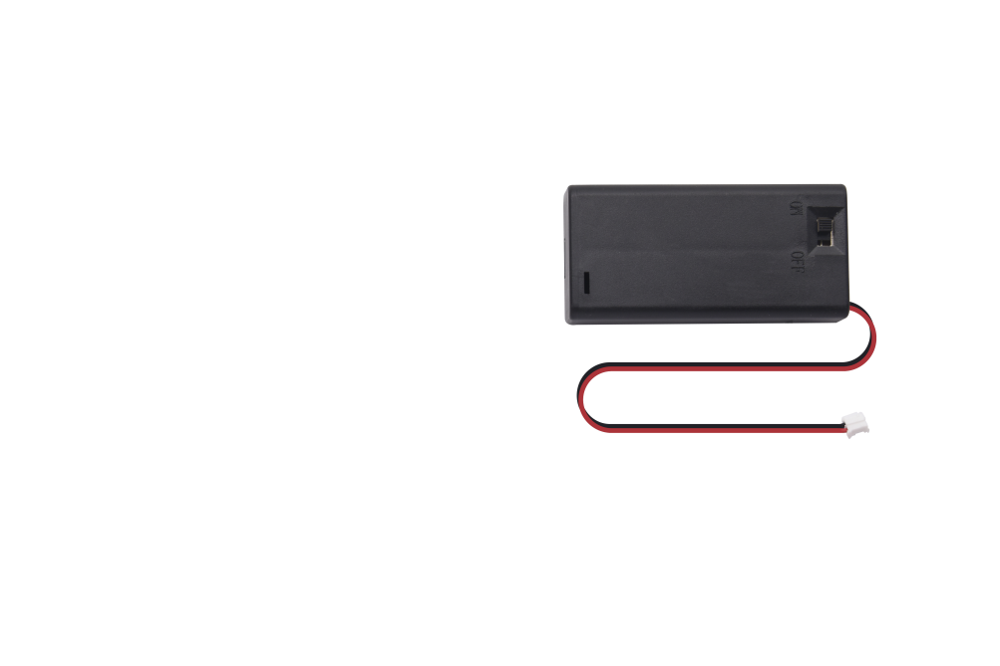   |
|         | 1.5V AA Battery (Not Included)                             | 2       |             |

# 3.Introduction

**( 1 )What is Micro:bit?**

Designed by BBC, Micro:bit main board aims to help children aged above 10 years
old to have a better learning of programming.

It is equipped with loads of components,including a 5\*5 LED dot matrix, 2
programmable buttons, a compass, a Micro USB interface and a Bluetooth module
and others. Though it is just the size of a credit card, it boasts multiple
functions. To name just a few, it can be applied in programming video games,
making interactions between light and sound, controlling a robot, conducting
scientific experiments, developing wearable devices and make some cool
inventions like robots and musical instruments, basically everything imaginable.

This new version, that’s the version 2.0, of Micro:bit main board has a
touch-sensitive logo and a MEMS microphone. And there is a buzzer built in the
other side of the board which makes playing all kinds of sound possible without
any external equipment. The golden fingers and gears added provide a better
fixing of crocodile clips. Moreover, this board has a sleeping mode to lower the
power consumption of battery and it can be entered if users long press the Reset
& Power button on the back of it. More importantly, the CPU capacity of this
version is much better than that of the V1.5 and the V2 has more RMA.

In final analysis, the Micro:bit main board V2 can allow customers to explore
more functions so as to make more innovative products.

**( 2 ) Comparison between V2.0 & V1.5**

**Micro:bit main Board V2.0**

**Micro:bit main Board V1.5**

**More details:**

For the Micro: Bit main board V2, pressing the Reset & Power button , it will
reset the Micro: Bit and rerun the program.If you hold it tight, the red LED
will slowly get darker.When the power indicator flickers into darkness,
releasing the button and your Micro: Bit board will enter sleep mode for power
saving .This will make your battery more durable. And you could press this
button again to ‘wake up’ your Micro:bit.

For more information,please resort to following links：

<https://tech.microbit.org/hardware/>

https://microbit.org/new-microbit/

https://www.microbit.org/get-started/user-guide/overview/

<https://microbit.org/get-started/user-guide/features-in-depth/>

**( 3 ) Pinout**

Micro:bit main board V2.0 VS V1.5

Browse the official website for more details:

<https://tech.microbit.org/hardware/edgeconnector/>

<https://microbit.org/guide/hardware/pins/>

**( 4 )Notes for the application of Micro:bit main board V2.0**

1.  It is recommended to cover it with a silicone protector to prevent short
    circuit for it has a lot of sophisticated electronic components.

2.  Its IO port is very weak in driving since it can merely handle current less
    than 300mA. Therefore, do not connect it with devices operating in large
    current,such as servo MG995 and DC motor or it will get burnt. Furthermore,
    you must figure out the current requirements of the devices before you use
    them and it is generally recommended to use the board together with a
    Micro:bit shield.

3.  It is recommended to power the main board via the USB interface or via the
    battery of 3V. The IO port of this board is 3V, so it does not support
    sensors of 5V. If you need to connect sensors of 5 V, a Micro: Bit expansion
    board is required.

d.When using pins(P3、P4、P6、P7、P10)shared with the LED dot matrix, blocking
them from the matrix or the LEDs may display randomly and the

data about sensors maybe wrong.

e.The battery port of 3V cannot be connected with battery more than 3.3V or the
main board will be damaged.

f. Forbid to use it on metal products to avoid short circuit.

To put it simple, Micro:bit V2 main board is like a micro computer which has
made programming at our fingertips and enhanced digital innovation. And about
programming environment, BBC provides a website: <https://microbit.org/code/,>
which has a graphical MakeCode program easy for use.

**4.Install Micro:bit Driver**

If you have downloaded micro:bit driver, then no need to download it again.

If it is you first time to use micro:bit main board, then you will have to
download the driver.

First of all, connect the micro:bit to your computer using a USB cable.

And enter the link https://fs.keyestudio.com/KS4011

to download the driver file of micro:bit,
.

# 5.Getting Started with Micro:bit

The following instructions are applied for Windows system but can also serve as
a reference if you are using a different system.

## 5.1 Write code and program

This chapter describes how to write program with the App Micro: Bit and load the
program to the Micro: Bit main board V2.

You are recommended to browse the official website of Micro:bit for more
details, and the link is attached below:

[https://microbit.org/guide/quick/](Https://microbit.org/guide/quick/)

**Step 1: connect the Micro: Bit main board V2 with your computer**

Firstly, link the Micro: Bit main board V2 with your computer via the USB
cable.Macs、PCs、 Chromebooks and Linux （including Raspberry Pi）systems are
all compatible with the Micro: Bit main board V2.

Note that if you are about to pair the board with your phone or tablet, please
refer to this link:

<https://microbit.org/get-started/user-guide/mobile/>

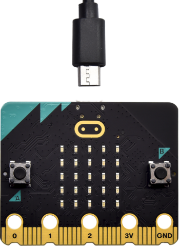

Secondly, if the red LED on the back of the board is on, that means the board is
powered. Then Micro: Bit main board V2 will appear on your computer as a driver
named 'MICROBIT(E)'. Please note that it is not an ordinary USB disk as shown
below.

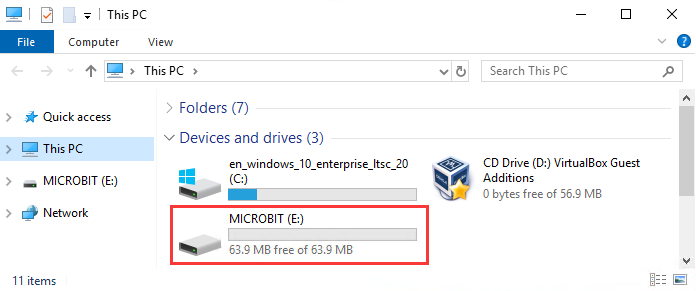

**Step 2: write programs**

View the link https://makecode.microbit.org/ in your browser;

Click ‘New Project’;

The dialog box‘Create a Project’ appears, fill it with ‘heartbeat’ and click
‘Create √’to edit.

(If you are running Windows 10 system, it is also viable to edit on the APP
MakeCode for micro:bit , which is exactly like editing in the website. And the
link to the APP is
https://www.microsoft.com/zh-cn/p/makecode-for-micro-bit/9pjc7sv48lcx?ocid=badgep&rtc=1&activetab=pivot:overviewtab
)

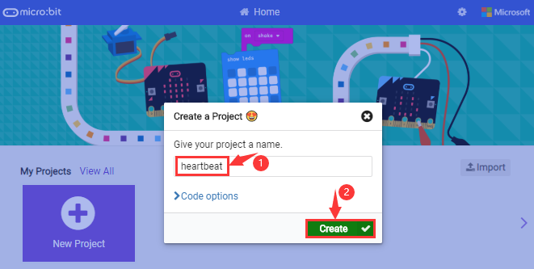

Write a set of micro:bit code. You can drag some modules in the Blocks to the
editing area and then run your program in Simulator of MakeCode editor as shown
in the picture below which demonstrates how to edit ‘heartbeat’ program .

As for loading test code , please turn to Chapter 5.5.

And introduction of Makecode is on the next chapter 5.2.

**Step 3: download test code**

If your computer is Windows 10 and you have downloaded the APP MakeCode for
micro:bit to write program, what you will have to do to download the program to
your Micro: Bit main board V2 is merely clicking the ‘Download’ button, then all
is done.

If you are writing programs through the website, following these steps:

Click the‘Download’ in the editor to download a "hex" file, which is a compact
program format that the Micro: Bit main board can read.Once the hexadecimal file
is downloaded, copy it to your board V2 just like the process that you copy the
file to the USB driver. If you are running Windows system, you can also
right-click and select ‘Send to → MICROBIT (E:) ‘to copy the hex file to the
Micro: Bit main board V2.

You can also directly drag the "hex" file onto the MICROBIT (E:) disk.

During the process of copying the downloaded hex file to the Micro: Bit main
board V2, the yellow signal light on the back side of the board flashes. When
the copy is completed, the yellow signal light will stop flashing and remain on.

**Step 4: run the program**

After the program is uploaded to the Micro: Bit main board V2, you could still
power it via the USB cable or change to via an external power. The 5 x 5 LED dot
matrix on the board displays the heartbeat pattern.

Power via micro USB cable

Power via external power（3V）

**Step 5：learn about other programming languages**

This chapter has described how to use the Micro: Bit main board V2.

But except for the Makecode graphical programming introduced you can also write
Micro: Bit programs in other languages. Go to the link:
<https://microbit.org/code/> to know about other programming languages , or view
the link: <https://microbit.org/projects/>, to find something you want to have a
go.

## 5.2 Makecode：

Browse <https://makecode.microbit.org/> and enter Makecode online editor or open
the APP MakeCode for micro:bit of Windows 10.

Click“New Project”, and input“heartbeat”，then enter Makecode editor, as shown
below:

There are blocks“on start”and“forever”in the code editing area.

When the power is plugged or reset,“on start”means that the code in the block
only executes once, while“forever”implies that the code runs cyclically.

## 5.3.Quick Download

As mentioned before, if your computer is Windows 10 and you have downloaded the
APP MakeCode for micro:bit to write programs, the program written can be quickly
downloaded to the Micro: Bit main board V2 by selecting ‘Download’.

While it is a little more trickier if you are using a browser to enter makecode.
However, if you use Google Chrome, suitable for Linux，macOS and Windows 10, the
process can be quicker too.

We use the webUSB function of Chrome to allow the internet page to access the
hardware device connected USB.

You could refer to the following steps to connect and pair devices.

**Device pairing:**

Connect micro:bit to your computer by USB cable. Click“...”beside“Download”and
click“Pair device”.

Then click another“Pair device”as shown below.

Then select ‘’BBC micro:bit CMSIS-DPA” and click “Connect”. If ‘’BBC micro:bit
CMSIS-DPA”does not show up for selection, please refer to
[https://makecode.microbit.org/device/usb/webusb/troubleshoot](https://makecode.microbit.org/device/usb/webusb/troubleshoot%20)

We also provide in the resource
link https://fs.keyestudio.com/KS4011.

What’s more, if you don’t know how to update the firmware of micro:bit, refer to
the link:
[https://microbit.org/guide/firmware/](https://microbit.org/guide/firmware/%20)
or browse folderwe provide.

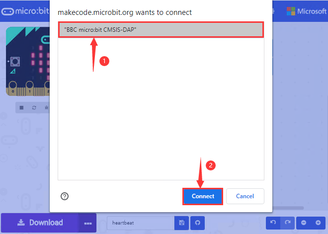

Then click”Download”. The program is directly downloaded to Micro: Bit main
board V2 and the sentence “Download completed!”appears.

## 5.4 Resources and test code

Tools ,test code and other resources can be downloaded via the link
[https://fs.keyestudio.com/KS401](https://fs.keyestudio.com/KS4005-4006)1

Download and unzip the file, you will see a file clip named KS4011Keyestudio
Micro:bit Honeycomb Smart Wearable Programmable Ultimate Kit, and it contains
following files:

## 5.5 Input test code

We provide hexadecimal code files (project files) for each project.The file
contains all the contents of the project and can be imported directly, or you
can manually drag the code blocks to complete the program for each project. For
simple projects, dragging a block of code to complete the program is
recommended. For complex projects, it is recommended to conduct the program by
importing the hexadecimal code file we provide.

Let's take the "Heatbeat" project as an example to show how to load the code.

Open the Web version of Makecode or the Windows 10 App version of
Makecode

Click “Import File”;

Select“ ../Makecode Code/Project 1\_ Heart beat/Project 1\_ Heart beat.hex” ;

Then click “Go ahead”.

In addition to importing the test code file provided into the Makecode compiler
above, you can also drag the the test code file provided into the code editing
area of the Makecode compiler, as shown in the figure below:

After a few seconds, it is done.

Note: if your computer system is Windows7 or 8 instead of Windows 10, the
pairing cannot be done via Google Chrome. Therefore, digital signal or analog
signal of sensors and modules cannot be shown on the serial port simulator.
However, you need to read the corresponding digital signal or analog signal.So
what can we do? You can use the CoolTerm software to read the serial port data
of the micro:bit. Next chapter is about how to install CoolTerm.

## 5.6 CoolTerm Installation

CoolTerm program is used to read the data on serial port.

Download CoolTerm program:

<https://freeware.the-meiers.org/>

1.  After the download, we need to install CoolTerm program file, below is
    Window system taken as an example.

2.  Choose“win”to download the zip file of CoolTerm

3.  Unzip file and open it. (also suitable for Mac and Linux system)

（2）Double-click .

The functions of each button on the Toolbar are listed below:
<http://wiki.keyestudio.com/index.php/File:IDE.png>

|         | Open up a new Terminal                           |
|--------------------------------------------------------|--------------------------------------------------|
|         | Open a saved Connection                          |
|         |  Save the current Connection to disk             |
|  | Open the Serial Connection                       |
|  | Close the Serial Connection                      |
|  | Clear the Received Data                          |
|  | Open the Connection Options Dialog               |
|  | Display the Terminal Data in Hexadecimal Format  |
|         | Display the Help Window                          |

# **6.Projects**

(Note: project 1 to 12 will be conducted with the built-in sensors and LED dot
matrix of the Micro:bit main board V2)

## Project 1: Heartbeat

**( 1 )Project Description**

This project is easy to conduct with a micro:bit V2 main board, a Micro USB
cable and a computer. The micro:bit LED dot matrix will display a relatively big
heart-shaped pattern and then a smaller one. This alternative change of these
two patterns is like heart beating. This experiment serves as a starter for your
entry to the programming world.

**( 2 )Components Needed:**

|  |
|-----------------------------------------------------|---------------------------------------------------|
| Micro:bit Main Board V2 \*1                         | Micro USB Cable\*1                                |

**( 3)Test Code:**

Attach the Micro:bit main board V2 to your computer via the Micro USB cable and
begin editing.

Firstly, click”basic”module and find and drag the block “show icon
 “ to module “forever”;

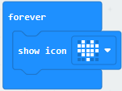

Secondly, click”basic”module again and find and drag the block “show icon
 “ to module “forever”and click
the little triangle to select “show icon
”;

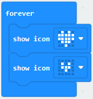

Thirdly, click”basic”module and find and drag the
block””to the code block and
click the littler triangle to select 500;

Complete Program：

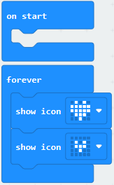

Note:the “on start”means that the code in the block only executes once,
while“forever”implies that the code runs cyclically.

Click”JS JavaScript”, you will find the corresponding programming languages.

Click the little triangle”of JS JavaScript”to choose “Python”, you will find the
corresponding Python programming languages.

**( 4 )Test Results:**

After uploading test code to micro:bit main board V2 and keeping the connection
with the computer to power the main board, the LED dot matrix shows pattern
“”and then
“”alternatively.

( Please refer to chapter 5.3 to know how to download test code quickly.)

If the downloading is not smooth, please remove the micro USB from the main
board and then reconnect them and reopen Makecode to try again.

## Project 2: Light A Single LED

**( 1 )Project Description:**

The LED dot matrix consists of 25 LEDs arranged in a 5 by 5 square. In order to
locate these LEDs quickly, as the figure shown below, we can regarded this
matrix as a coordinate system and create two aces by marking those in rows from
0 to 4 from top to bottom, and the ones in columns from 0 to 4 from the left to
the right. Therefore, the LED sat in the second of the first line is (1,0）and
the LED positioned in the fifth of the fourth column is (3,4）and others
likewise.

**( 2 )Components Needed:**

-   Micro:bit main board V2 \*1

-   Micro USB cable\*1

**( 3 )Test Code:**

Attach the Micro:bit main board V2 to your computer via the Micro USB cable and
begin editing.

Firstly, click”Led”module and then the”more”module to find and drag the block
“led enable false “ to block“on start”; click the little triangle of “led enable
false “ to select”true”;

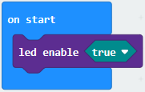

Secondly, click”Led”module and to find and drag the block “toggle x 0 y 0“ to
block“forever”and alter “x0” to”x1”;

Thirdly, click”Basic”module to find and drag the block”pause(ms)100”to “forever”
block and set pause to 500;

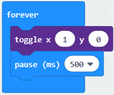

Fourthly, copy the block  and
place it into forever” block;

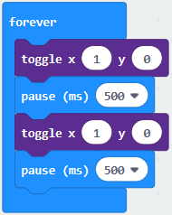

Fifthly, click”Led”module to find and drag the block”plot x 0 y 0”to “forever”
block and change the “x 0 y 0” to “x 3 y 4”;

Sixthly, copy the block “pause(ms)500” and place it into forever” block;

Lastly, click”Led”module to find and drag the block”unplot x 0 y 0”to “forever”
block and change “x 0 y 0” to “x 3 y 4”;and copy and place the
block“pause(ms)500”to block “forever”;

Complete Program：

Click”JS JavaScript”, you will find the corresponding programming languages.

Click the little triangle”of JS JavaScript”to choose “Python”, you will find the
corresponding Python programming languages.

**( 4)Test Results**

After uploading test code to micro:bit main board V2 and powering the main board
via the USB cable, the LED in (1,0) lights up for 0.5s and the one in (3,4)
shines for 0.5s and repeat this sequence.

## Project 3: LED Dot Matrix

**( 1 )Project Description:**

Dot matrices are very commonplace in daily life. They have found wide
applications in LED advertisement screens, elevator floor display, bus stop
announcement and so on.

The LED dot matrix of Micro: Bit main board V2 contains 25 LEDs in a grid.
Previously, we have succeeded in controlling a certain LED to light by
integrating its position value into the test code. Supported by the same theory,
we can turn on many LEDs at the same time to showcase patterns, digits and
characters.

What’s more, we can also click”show icon“ to choose the pattern we like to
display. Last but not the least, we can design our patterns by ourselves.

**( 2 )Components Needed:**

-   Micro:bit main board V2 \*1

-   Micro USB cable\*1

**( 3 )Test Code 1：**

Link computer with micro:bit board by micro USB cable, and program in MakeCode
editor.

1.  A. Enter“Led”→“more”→“led enable false”

2.  Click the drop-down triangle button to select“true”
    

3.  Combine it with “on start” block

\*\*\*\*\*\*\*\*\*\*\*\*\*\*\*\*\*\*\*\*\*\*\*\*\*\*\*\*\*\*\*\*\*\*\*\*\*\*\*\*\*\*\*\*\*\*\*\*\*\*\*\*\*\*\*\*\*\*\*\*\*\*\*\*\*

1.  Click“Led”to move“plot x 0 y 0”into“forever”，then replicate“plot x 0 y
    0”for 8 times, respectively set to“x 2”y 0”,“x 2”y 1”,“x 2”y 2”,“x 2”y 3”,“x
    2”y 4”,“x 1”y 3”“x 0”y 2”,“x 3”y 3”,“x 4”y 2”.

Complete Program：

|  |
|-------------------------------------------------|
|                                                 |

Select“JavaScript" and“Python”to switch into JavaScript and Python language
code:

**( 4 )Test Results 1：**

Upload code 1 and power on , we will see the
 icon

**( 5 ) Test Code 2：**

Link computer with micro:bit board by micro USB cable, and program in MakeCode
editor.

1.  A. Enter“Basic”→“show number 0”block,

2.  Duplicate it for 4 times, then separately set to“show number 1”,“show number
    2”,“show number 3”,“show number 4”,“show number 5”.

\*\*\*\*\*\*\*\*\*\*\*\*\*\*\*\*\*\*\*\*\*\*\*\*\*\*\*\*\*\*\*\*\*\*\*\*\*\*\*\*\*\*\*\*\*\*\*\*\*\*\*\*\*\*\*\*\*\*\*\*\*\*\*\*\*

1.  Click“Basic”→“show leds”, then put it into“forever”block，tick blue boxes to
    light LED and generate“↓”pattern.

    

\*\*\*\*\*\*\*\*\*\*\*\*\*\*\*\*\*\*\*\*\*\*\*\*\*\*\*\*\*\*\*\*\*\*\*\*\*\*\*\*\*\*\*\*\*\*\*\*\*\*\*\*\*\*\*\*\*\*\*\*\*\*\*\*\*

1.  Move out the block“show string” from“Basic”block, and leave it beneath
    the“show leds” block

    

Choose“show icon”from“Basic”block, and leave it beneath the block“show
string“Hello!”block

\*\*\*\*\*\*\*\*\*\*\*\*\*\*\*\*\*\*\*\*\*\*\*\*\*\*\*\*\*\*\*\*\*\*\*\*\*\*\*\*\*\*\*\*\*\*\*\*\*\*\*\*\*\*\*\*\*\*\*\*\*\*\*\*\*

1.  A. Enter“Basic”→“show arrow North”;

B. Leave it into“forever”block，replicate“show arrow North”for 3
times，respectively set to“North East”,“South East”, “South West”,“North West”.

1.  Click“Basic”to get block“clear screen”then remain it below the block “show
    arrow North West”

\*\*\*\*\*\*\*\*\*\*\*\*\*\*\*\*\*\*\*\*\*\*\*\*\*\*\*\*\*\*\*\*\*\*\*\*\*\*\*\*\*\*\*\*\*\*\*\*\*\*\*\*\*\*\*\*\*\*\*\*\*\*\*\*\*

(5) Drag“pause (ms) 100”block from“Basic”block and set to 500ms, then leave it
below“clear screen”block.

Complete Program:

|   |
|--------------------------------------------------|
|                                                  |

Select“JavaScript" and“Python”to switch into JavaScript and Python language
code:

**( 6 )Test Results 2：**

Upload code 2 and plug micro:bit to power. Micro: bit starts showing number 1,
2, 3, 4, and 5, then cyclically
display,“Hello!”,
,
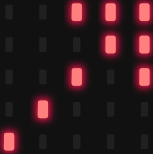,
,
 and
patterns.

## Project 4: Programmable Buttons

**( 1 )Project Description:**

Buttons can be used to control circuits. In an integrated circuit with a button,
the circuit is connected when pressing the button and it is open the other way
around.

Micro: Bit main board V2 boasts three buttons, two are programmable
buttons(marked with A and B), and the one on the other side is a reset button.
By pressing the two programmable buttons can input three different signals. We
can press button A or B alone or press them together and the LED dot matrix
shows A,B and AB respectively. Let’s get started.

**( 2 )Components Needed:**

-   Micro:bit main board V2 \*1

-   Micro USB cable\*1

**( 3 )Test Code 1：**

Link computer with micro:bit board by micro USB cable, and program in MakeCode
editor,

1.  Delete“on start”and“forever”firstly，then click“Input”→“on button A pressed”

\*\*\*\*\*\*\*\*\*\*\*\*\*\*\*\*\*\*\*\*\*\*\*\*\*\*\*\*\*\*\*\*\*\*\*\*\*\*\*\*\*\*\*\*\*\*\*\*\*\*\*\*\*\*\*\*\*\*\*\*\*\*\*\*\*

1.  A. Click“Basic”→“show string”;

B. Then place it into“on button A pressed”block, change
“Hello!”into“A”.

1.  Copy code stringonce, tap the
    drop-down button“A”to select“B”and modify
    character“A”into“B”.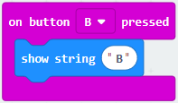

\*\*\*\*\*\*\*\*\*\*\*\*\*\*\*\*\*\*\*\*\*\*\*\*\*\*\*\*\*\*\*\*\*\*\*\*\*\*\*\*\*\*\*\*\*\*\*\*\*\*\*\*\*\*\*\*\*\*\*\*\*\*\*\*\*

1.  Copyonce，and set to“on
    button A+B pressed”and“show string “AB”

\*\*\*\*\*\*\*\*\*\*\*\*\*\*\*\*\*\*\*\*\*\*\*\*\*\*\*\*\*\*\*\*\*\*\*\*\*\*\*\*\*\*\*\*\*\*\*\*\*\*\*\*\*\*\*\*\*\*\*\*\*\*\*\*\*

Complete Code:

|  |
|-------------------------------------------------|
|                                                 |

Select“JavaScript" and“Python”to switch into JavaScript and Python language
code:

**( 4 )Test Results 1：**

After uploading test code 1 to micro:bit main board V2 and powering the main
board via the USB cable, the 5\*5 LED dot matrix shows A if button A is pressed,
B if button B pressed, and AB if button A and B pressed together.

**( 5 ) Test Code 2：**

1.  A. Click“Led”→“more”→“led enable false”,

B. Put it into the block“on start”，click drop-down triangle button to
select“true” .

\*\*\*\*\*\*\*\*\*\*\*\*\*\*\*\*\*\*\*\*\*\*\*\*\*\*\*\*\*\*\*\*\*\*\*\*\*\*\*\*\*\*\*\*\*\*\*\*\*\*\*\*\*\*\*\*\*\*\*\*\*\*\*\*\*

1.  A. Tap“Variables”→“Make a Variable...”→“New variable name：”

B. Enter“item”in the dialog box and click“OK”，then variable“item”is produced.
And move“set item to 0”into“on start”block

\*\*\*\*\*\*\*\*\*\*\*\*\*\*\*\*\*\*\*\*\*\*\*\*\*\*\*\*\*\*\*\*\*\*\*\*\*\*\*\*\*\*\*\*\*\*\*\*\*\*\*\*\*\*\*\*\*\*\*\*\*\*\*\*\*

1.  A. Click“Input”→“on button A pressed”.

B. Go to“Variables”→“ change item by 1 ”

C. Place it into“on button A pressed”and 1 is modified into
5.

\*\*\*\*\*\*\*\*\*\*\*\*\*\*\*\*\*\*\*\*\*\*\*\*\*\*\*\*\*\*\*\*\*\*\*\*\*\*\*\*\*\*\*\*\*\*\*\*\*\*\*\*\*\*\*\*\*\*\*\*\*\*\*\*\*

1.  Duplicatecode string
    once，click the drop-down button to select“B”，then set“change item by
    \-5”.

\*\*\*\*\*\*\*\*\*\*\*\*\*\*\*\*\*\*\*\*\*\*\*\*\*\*\*\*\*\*\*\*\*\*\*\*\*\*\*\*\*\*\*\*\*\*\*\*\*\*\*\*\*\*\*\*\*\*\*\*\*\*\*\*\*

1.  A. Enter“Led”→“plot bar graph of 0 up to 0”

B. Keep it into“forever”block

C. Go to“Variables”to move“item”into 0 box，change 0 into 25.

\*\*\*\*\*\*\*\*\*\*\*\*\*\*\*\*\*\*\*\*\*\*\*\*\*\*\*\*\*\*\*\*\*\*\*\*\*\*\*\*\*\*\*\*\*\*\*\*\*\*\*\*\*\*\*\*\*\*\*\*\*\*\*\*\*

(6)A. Go to“Logic”to move out “if...true...then...”and “=”blocks，

B. Keep“=”into“true”box and set to “\>”

C. Select“item”in the“Variables”and lay it down at left box of “\>”，change 0
into 25；

D. Enter“Variables”to drag“set item to 0”block into“if...true..then...”, alter 0
into 25.

\*\*\*\*\*\*\*\*\*\*\*\*\*\*\*\*\*\*\*\*\*\*\*\*\*\*\*\*\*\*\*\*\*\*\*\*\*\*\*\*\*\*\*\*\*\*\*\*\*\*\*\*\*\*\*\*\*\*\*\*\*\*\*\*\*

(7) A. Replicate code stringonce

B.“\>” is modified into “\<” and 25 is changed into 0,

C. Leave it beneath code string.

Complete Program：

|  |
|-------------------------------------------------|
|                                                 |

Select“JavaScript" and“Python”to switch into JavaScript and Python language
code:

**( 6 )Test Results 2：**

After uploading test code 2 to micro:bit main board V2 and powering the main
board via the USB cable, when pressing the button A the LEDs turning red
increase while when pressing the button B the LEDs turning red reduce.

## Project 5: Temperature Detection

**( 1 )Project Description:**

Actually ,the Micro:bit main board V2 is not equipped with a temperature sensor,
but uses the temperature sensor built into NFR52833 chip for temperature
detection. Therefore, the detected temperature is more closer to the temperature
of the chip, and there maybe deviation from the ambient temperature.

**( 2 )Components Needed:**

-   Micro:bit main board V2 \*1

-   Micro USB cable\*

**( 3 )Test Code 1：**

1.  Click“Advanced”→”Serial”→“serial redirect to USB”into“on start”

\*\*\*\*\*\*\*\*\*\*\*\*\*\*\*\*\*\*\*\*\*\*\*\*\*\*\*\*\*\*\*\*\*\*\*\*\*\*\*\*\*\*\*\*\*\*\*\*\*\*\*\*\*\*\*\*\*\*\*\*\*\*\*\*\*

1.  A. Go to“Serial”→“serial write value“x”=0”into “forever”

1.  Click“Input” → “temperature(℃)” into“into serial write value“x”=0 and
    change”0”into “temperature”

\*\*\*\*\*\*\*\*\*\*\*\*\*\*\*\*\*\*\*\*\*\*\*\*\*\*\*\*\*\*\*\*\*\*\*\*\*\*\*\*\*\*\*\*\*\*\*\*\*\*\*\*\*\*\*\*\*\*\*\*\*\*\*\*\*

1.  Go to“Basic”→“pause (ms) 100”into “forever”and set pause to 500

\*\*\*\*\*\*\*\*\*\*\*\*\*\*\*\*\*\*\*\*\*\*\*\*\*\*\*\*\*\*\*\*\*\*\*\*\*\*\*\*\*\*\*\*\*\*\*\*\*\*\*\*\*\*\*\*\*\*\*\*\*\*\*\*\*

Complete Program：

Select“JavaScript" and“Python”to switch into JavaScript and Python language
code:

**( 4 )Test Results 1：**

After uploading test code 1 to micro:bit main board V2, powering the main board
via the USB cable, and clicking “Show console Device”, the data of temperature
shows in the serial monitor page as shown below.

If you're running Windows 7 or 8 instead of Windows 10, via Google Chrome won't
be able to match devices. You'll need to use the CoolTerm serial monitor
software to read data.

You could open CoolTerm software, click Options, select SerialPort, set COM port
and baud rate to 115200 (after testing, the baud rate of USB SerialPort
communication on Micro: Bit main board V2 is 115200), click OK, and Connect. The
CoolTerm serial monitor shows the change of temperature in the current
environment, as shown in the figures below :

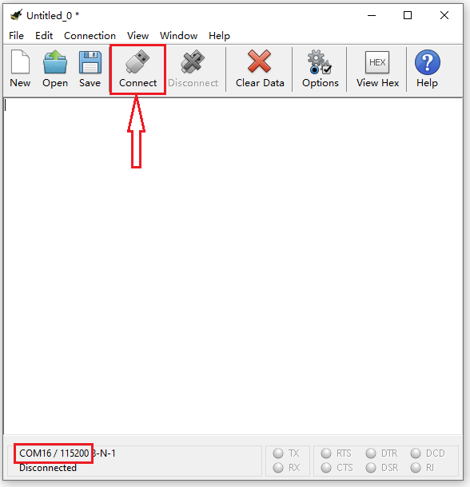

**( 5 )Test Code 2：**

Link computer with micro:bit board by micro USB cable, and program in MakeCode
editor,

1.  A. Go to“Led”→“more”→“led enable false”block,

B. Keep it into the“on start”block，tap the triangle button to
select“true”.

\*\*\*\*\*\*\*\*\*\*\*\*\*\*\*\*\*\*\*\*\*\*\*\*\*\*\*\*\*\*\*\*\*\*\*\*\*\*\*\*\*\*\*\*\*\*\*\*\*\*\*\*\*\*\*\*\*\*\*\*\*\*\*\*\*

1.  Tap“Logic”and drag“if...then...else”into“forever”block; and then drag “=”
    into “true”

1.  Enter“Input”to move“temperature(℃)”into the left side of “=”; click the
    little triangle of “=”to choose “≥”,and change the “0”to “35”

1.  Click“Basic”to find out block“show icon”and move it into“then”; copy and
    place the block“show icon”to “else”and click the little triangle of
    “”to select
    “”

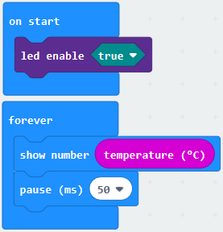Complete Program：

Select“JavaScript" and“Python”to switch into JavaScript and Python language
code:

**( 6 )Test Results 2：**

After uploading the code 2, when the ambient temperature is less than 35℃,
5\*5LED will show. When the
temperature is equivalent to or greater than 35℃, the
pattern will appear.

## Project 6: Geomagnetic Sensor

**( 1 )Project Description:**

This project aims to explain the use of the Micro: bit geomagnetic sensor, which
can not only detect the strength of the geomagnetic field, but also be used as a
compass to find bearings. It is also an important part of the Attitude and
Heading Reference System (AHRS). Micro: Bit main board V2 uses LSM303AGR
geomagnetic sensor, and the dynamic range of magnetic field is ±50 gauss. In the
board, the magnetometer module is used in both magnetic detection and compass.
In this experiment, the compass will be introduced first, and then the original
data of the magnetometer will be checked.The main component of a common compass
is a magnetic needle, which can be rotated by the geomagnetic field and point
toward the geomagnetic North Pole (which is near the geographic South Pole) to
determine direction.

**( 2 )Components Needed:**

-   Micro:bit main board V2 \*1

-   Micro USB cable\*1

**( 3 )Test Code 1：**

Link computer with micro:bit board by micro USB cable, and program in MakeCode
editor.

1.  A. Click“Input”→“more”→“calibrate compass”

B. Lay down it into block“on start”.

1.  A. Go to“Input”→“on button A pressed”.

B. Enter“Basic”→“show number”, put it into“on button A pressed”block;

C. Tap“Input”→“compass heading(℃)”， and place it into“show number”

\*\*\*\*\*\*\*\*\*\*\*\*\*\*\*\*\*\*\*\*\*\*\*\*\*\*\*\*\*\*\*\*\*\*\*\*\*\*\*\*\*\*\*\*\*\*\*\*\*\*\*\*\*\*\*\*\*\*\*\*\*\*\*\*\*\*\*\*\*\*\*\*\*\*\*\*\*\*

Complete Program：

|  |
|------------------------------------------------------|
|                                                      |

Select“JavaScript" and“Python”to switch into JavaScript and Python language
code:

**( 4 )Test Results 1：**

After uploading test code to micro:bit main board V2 and powering the board via
the USB cable, and pressing the button A, the board asks us to calibrate compass
and the LED dot matrix shows “TILT TO FILL SCREEN”. Then enter the calibration
page. Rotate the board until all 25 LEDs are on red as shown below.

After that, a smile pattern
 appears, which implies
the calibration is done. When the calibration process is completed, pressing the
button A will make the magnetometer reading display directly on the screen. And
the direction north, east, south and west correspond to 0°, 90°, 180° and 270°.

**( 5 ) Test Code 2：**

This module can keep readings to determine direction, so does point to the
current magnetic North Pole by arrow.

For the above picture, the arrow pointing to the upper right when the value
ranges from 292.5 to 337.5. 0.5 can’t be input in the code, thereby, the values
we get are 293 and 338.

Link computer with micro:bit board by micro USB cable, and program in MakeCode
editor,

1.  

2.  Enter“Input”→ “more”→“calibrate compass”

3.  Move“calibrate compass”into“on start”

\*\*\*\*\*\*\*\*\*\*\*\*\*\*\*\*\*\*\*\*\*\*\*\*\*\*\*\*\*\*\*\*\*\*\*\*\*\*\*\*\*\*\*\*\*\*\*\*\*\*\*\*\*\*\*\*\*\*\*\*\*\*\*\*\*

1.  A. Click“Variables”→“Make a Variable...”→“New variable name：”

B. Input“x”in the blank box and click“OK”, and the variable “x” is generated.

C. Drag out“set x to”into“forever”block

1.  A. Go to“Input”→“compass heading(℃)”, and keep it into“0”box

1.  Tap“Logic”→“if...then...else”, leave it below block“sex x to compass
    heading”, then clickicon for
    6 times.

\*\*\*\*\*\*\*\*\*\*\*\*\*\*\*\*\*\*\*\*\*\*\*\*\*\*\*\*\*\*\*\*\*\*\*\*\*\*\*\*\*\*\*\*\*\*\*\*\*\*\*\*\*\*\*\*\*\*\*\*\*\*\*\*\*

1.  A. Place“and”into“true”block

B. Then move“=”block to the left box of “and”

C. Click“Variables”to drag“x”to the left “0”box, change 0 into 293 and set to
“≥”;

D. Then copy“x≥293”once and leave it to the right “0”box and set to“x\<338”

\*\*\*\*\*\*\*\*\*\*\*\*\*\*\*\*\*\*\*\*\*\*\*\*\*\*\*\*\*\*\*\*\*\*\*\*\*\*\*\*\*\*\*\*\*\*\*\*\*\*\*\*\*\*\*\*\*\*\*\*\*\*\*\*\*

1.  A. Go to“Basic”→“show leds”

B. Lay it down beneath block,
then click“show leds”and the pattern
appears.

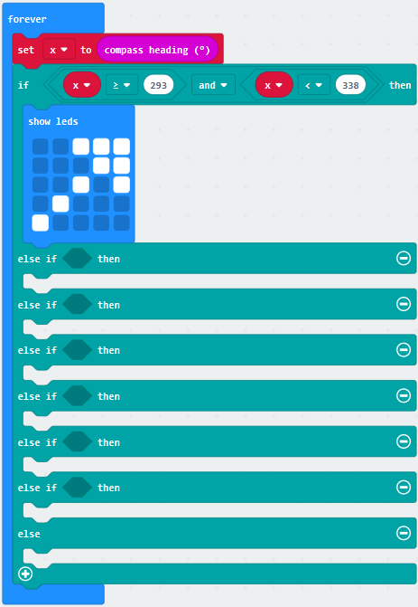

1.  A. Duplicate for 6 times.

B. Separately leave them into the blank boxes behind “else if”.

C. Set to“x≥23 and x\<68”,“x≥68 and x\<113 ”,“x≥113 and x\<158 ”,“x≥158 and
x\<203 ”,“x≥203 and x\<248 ”,“x≥248 and x\<293 ”respectively.

D. Then copy “show leds”for 7 times and keep them below the “else if.......then”
block respectively.

E. Click the blue boxes to form the
pattern“”,
“”,
“”,
“”,
“”,
“”and
“”.

\*\*\*\*\*\*\*\*\*\*\*\*\*\*\*\*\*\*\*\*\*\*\*\*\*\*\*\*\*\*\*\*\*\*\*\*\*\*\*\*\*\*\*\*\*\*\*\*\*\*\*\*\*\*\*\*\*\*\*\*\*\*\*\*\*\*\*\*\*\*\*\*\*\*\*\*\*

Complete Program：

| pattern appears       |
|------------------------------------------------------------------------------------------------------------------------------------------------------------------------------------------------------------------------------------------------------------------------------------------------------------------------------------------------------------------------------------------------------------------------------------------------------------------------------------------------------------------------------------------------------------------------------------------------------------------------------------------------------------------------------------------------------------------------------------------------------------------------------------------------------------------------------------------------------------------------------------------------------------------------------------------------------------------------------------------------------------------------------------------------------------------------------------------------------------------------------------------------------------------------------------------------------------------------|
|  When x is not among the above rang, the next program will be executed under else block                                                                                                                                                                                                                                                                                                                        |

Select“JavaScript" and“Python”to switch into JavaScript and Python language
code:

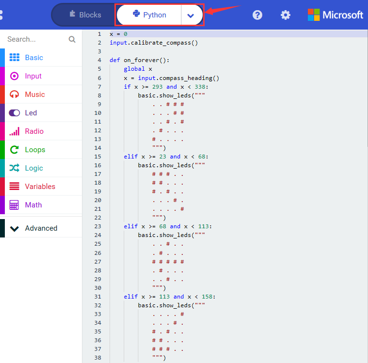

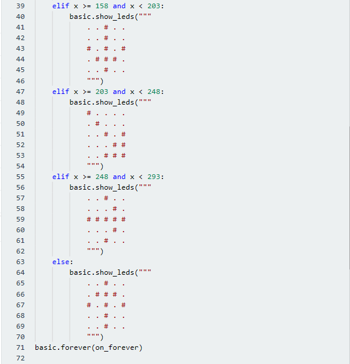

**( 6 ) Test Results 2**

Upload code 2 and plug micro:bit to power. After calibration, tilt micro:bit
board, the LED dot matrix displays the direction signs.

## Project 7: Accelerometer

**( 1 )Project Description:**

The Micro: Bit main board V2 has a built-in LSM303AGR gravity acceleration
sensor, also known as accelerometer, with a resolution of 8/10/12 bits. The code
section sets the range to 1g, 2g, 4g, and 8g.

We often use accelerometer to detect the status of machines.

In this project, we will introduce how to measure the position of the board with
the accelerometer. And then have a look at the original three-axis data output
by the accelerometer.

**( 2 )Components Needed:**

-   Micro:bit main board V2 \*1

-   Micro USB cable\*1

**( 3 )Test Code 1：**

Link computer with micro:bit board by micro USB cable, and program in MakeCode
editor,

(1) A. Enter“Input”→“on shake”，

B. Click“Basic”→“show number”, place it into“on shake”block, then change 0 into
1.

\*\*\*\*\*\*\*\*\*\*\*\*\*\*\*\*\*\*\*\*\*\*\*\*\*\*\*\*\*\*\*\*\*\*\*\*\*\*\*\*\*\*\*\*\*\*\*\*\*\*\*\*\*\*\*\*\*\*\*\*\*\*\*\*\*

(2) A. Copy code string for 7
times;

1.  separately click the triangle button to select“logo up”,“logo down”,“screen
    up”,“screen down”,“tilt left”,“tilt right”and“free fall”, then respectively
    change 1 into 2, 3, 4, 5, 6, 7, 8.

\*\*\*\*\*\*\*\*\*\*\*\*\*\*\*\*\*\*\*\*\*\*\*\*\*\*\*\*\*\*\*\*\*\*\*\*\*\*\*\*\*\*\*\*\*\*\*\*\*\*\*\*\*\*\*\*\*\*\*\*\*\*\*\*\*

Complete Program：

|  |
|--------------------------------------------------------|
|                                                        |

| 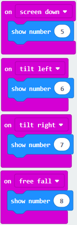 |
|-------------------------------------------------|
|                                                 |

Select“JavaScript" and“Python”to switch into JavaScript and Python language
code:

**( 4 )Test Results 1:**

After uploading the test code 1 to micro:bit main board V2 and powering the
board via the USB cable, if we shake the Micro: Bit main board V2. no matter at
any direction, the LED dot matrix displays the digit “1”.

When it is kept upright (put its logo above the LED dot matrix）, the number 2
will show.

When it is kept upside down(make its logo below the LED dot matrix) , it will
show as below.

When it is placed still on the desk, showing its front side, the number 4
appears.

When it is placed still on the desk, showing its back side, the number 5 will
exhibit.

When the board is tilted to the left , the LED dot matrix shows the number 6 as
shown below.

When the board is tilted to the right , the LED dot matrix displays the number 7
as shown below

When the board is knocked to the floor, this process can be considered as a free
fall and the LED dot matrix shows the number 8. (please note that this test is
not recommended for it may damage the main board.)

Attention: if you’d like to try this function, you can also set the acceleration
to 3g, 6g or 8g. But still ,we don not recommend.

**( 5 )Test Code 2：**

1.  A. Go to“Advanced”→“Serial”→“serial redirect to USB”

B. Drag it into“on start”

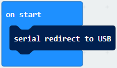

\*\*\*\*\*\*\*\*\*\*\*\*\*\*\*\*\*\*\*\*\*\*\*\*\*\*\*\*\*\*\*\*\*\*\*\*\*\*\*\*\*\*\*\*\*\*\*\*\*\*\*\*\*\*\*\*\*\*\*\*\*\*\*\*\*

1.  A. Enter“Serial”→“serial write value x =0”

B. Leave it into“forever”block

\*\*\*\*\*\*\*\*\*\*\*\*\*\*\*\*\*\*\*\*\*\*\*\*\*\*\*\*\*\*\*\*\*\*\*\*\*\*\*\*\*\*\*\*\*\*\*\*\*\*\*\*\*\*\*\*\*\*\*\*\*\*\*\*\*

1.  A. Click“Input”→“acceleration(mg) x”；

B. Keep it into“0”box and capitalize the“x”

\*\*\*\*\*\*\*\*\*\*\*\*\*\*\*\*\*\*\*\*\*\*\*\*\*\*\*\*\*\*\*\*\*\*\*\*\*\*\*\*\*\*\*\*\*\*\*\*\*\*\*\*\*\*\*\*\*\*\*\*\*\*\*\*\*

1.  Go to“Basic”and move out“pause (ms) 100”below the
    block, then set to 100ms.

    

\*\*\*\*\*\*\*\*\*\*\*\*\*\*\*\*\*\*\*\*\*\*\*\*\*\*\*\*\*\*\*\*\*\*\*\*\*\*\*\*\*\*\*\*\*\*\*\*\*\*\*\*\*\*\*\*\*\*\*\*\*\*\*\*\*

1.  Replicate code string

for 3 times and keep them into“forever”block，separately set the whole code
string as follows:

Complete Program：

|    |
|---------------------------------------------------|
|                                                   |

Select“JavaScript" and“Python”to switch into JavaScript and Python language
code:

**( 6 ) Test Results 2**

Upload test code to micro:bit main board V2, power the main board via the USB
cable, and click “Show console Device”.

After referring to the MMA8653FC data manual and the hardware schematic diagram
of the Micro: Bit main board V2, the accelerometer coordinate of the Micro: Bit
V2 motherboard are shown in the figure below:

The following interface shows the decomposition value of acceleration in X axis,
Y axis and Z axis respectively, as well as acceleration synthesis (acceleration
synthesis of gravity and other external forces).

If you're running Windows 7 or 8 instead of Windows 10, via Google Chrome won't
be able to match devices. You'll need to use the CoolTerm serial monitor
software to read data.

You could open CoolTerm software, click Options, select SerialPort, set COM port
and baud rate to 115200 (after testing, the baud rate of USB SerialPort
communication on Micro: Bit main board V2 is 115200), click OK, and Connect. The
CoolTerm serial monitor shows the data of X axis, Y axis and Z axis , as shown
in the figures below :

## Project 8: Light Detection

**( 1 )Project Description:**

In this project, we focus on the light detection function of the Micro: Bit main
board V2. It is achieved by the LED dot matrix. And it can be viewed as a
photosensor.

**( 2 )Components Needed:**

-   Micro:bit main board V2 \*1

-   Micro USB cable\*1

**( 3 )Test Code：**

Link computer with micro:bit board by micro USB cable, and program in MakeCode
editor,

(1)A. Enter“Advanced”→“Serial”→“serial redirect to USB”;

B. Drag it into“on start”block.

\*\*\*\*\*\*\*\*\*\*\*\*\*\*\*\*\*\*\*\*\*\*\*\*\*\*\*\*\*\*\*\*\*\*\*\*\*\*\*\*\*\*\*\*\*\*\*\*\*\*\*\*\*\*\*\*\*\*\*\*\*\*\*\*\*

(2) A. Go to“Serial”→“serial write value x =0”;

B. Move it into“forever”

1.  A. Click“Input”→“acceleration(mg) x”

B. Put“acceleration(mg) x”in the“0”box and change “x”into“Light intensity”.

\*\*\*\*\*\*\*\*\*\*\*\*\*\*\*\*\*\*\*\*\*\*\*\*\*\*\*\*\*\*\*\*\*\*\*\*\*\*\*\*\*\*\*\*\*\*\*\*\*\*\*\*\*\*\*\*\*\*\*\*\*\*\*\*\*

1.  A. Click“Basic”→“pause (ms) 100”;

B. Lay it down into“forever”and set to 100ms.

\*\*\*\*\*\*\*\*\*\*\*\*\*\*\*\*\*\*\*\*\*\*\*\*\*\*\*\*\*\*\*\*\*\*\*\*\*\*\*\*\*\*\*\*\*\*\*\*\*\*\*\*\*\*\*\*\*\*\*\*\*\*\*\*\*

Complete Program：

|  |
|-------------------------------------------------|
|                                                 |

Select“JavaScript" and“Python”to switch into JavaScript and Python language
code:

**( 4 )Test Results:**

Upload the test code to micro:bit main board V2, power the board via the USB
cable and click “Show console Device”.

When the LED dot matrix is covered by hand, the light intensity showed is
approximately 0; when the LED dot matrix is exposed to light,the light intensity
displayed gets stronger with the light as shown below.

The 20 in the code is an arbitrary value of light intensity. If the current
light level is less than or equal to 20, the moon will appear on the LED dot
matrix. If it's bigger than 20, the sun will appear.

If you're running Windows 7 or 8 instead of Windows 10, via Google Chrome won't
be able to match devices. You'll need to use the CoolTerm serial monitor
software to read data.

You could open CoolTerm software, click Options, select SerialPort, set COM port
and baud rate to 115200 (after testing, the baud rate of USB SerialPort
communication on Micro: Bit main board V2 is 115200), click OK, and Connect. The
CoolTerm serial monitor shows the value of light intensity , as shown in the
figures below :

## Project 9: Speaker

**( 1 )Project Description:**

The Micro: Bit main board V2 has an built-in speaker, which makes adding sound
to the programs easier. We can program the speaker to air all kinds of tones .

**( 2 )Components Needed:**

-   Micro:bit main board V2 \*1

-   Micro USB cable\*1

**( 3 )Test Code：**

Link computer with micro:bit board by micro USB cable, and program in MakeCode
editor,

1.  Enter“Basic”module to find “show icon”and drag it into “on start”block;

Click the little triangle to find
“”:

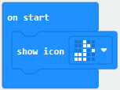

\*\*\*\*\*\*\*\*\*\*\*\*\*\*\*\*\*\*\*\*\*\*\*\*\*\*\*\*\*\*\*\*\*\*\*\*\*\*\*\*\*\*\*\*\*\*\*\*\*\*\*\*\*\*\*\*\*\*\*\*\*\*\*\*\*

(2) Enter“Music”module to find and drug“play sound giggle until done” into
“forever”block;

Enter“Basic”module to find and drug“pause(ms) 100” into “forever” block ;

Change 100 into 1000;

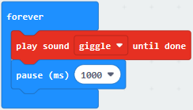

( 3 ) Copy  three times and place
it into “forever” block ;

Click the little triangle to select “happy”,”hello”,”yawn”;

\*\*\*\*\*\*\*\*\*\*\*\*\*\*\*\*\*\*\*\*\*\*\*\*\*\*\*\*\*\*\*\*\*\*\*\*\*\*\*\*\*\*\*\*\*\*\*\*\*\*\*\*\*\*\*\*\*\*\*\*\*\*\*\*\*

Complete Program：

Select“JavaScript" and“Python”to switch into JavaScript and Python language
code:

**( 4 )Test Results:**

After uploading the test code to micro:bit main board V2 and powering the board
via the USB cable, the speaker utters sound and the LED dot matrix shows the
logo of music.

## Project 10: Touch-sensitive Logo

**( 1 )Project Description:**

The Micro: Bit main board V2 is equipped with a golden touch-sensitive logo,
which can act as an input component and function like an extra button.

It contains a capacitive touch sensor that senses small changes in the electric
field when pressed (or touched), just like your phone or tablet screen do.When
you press it , you can activate the program.

**( 2 )Components Needed:**

-   Micro:bit main board V2 \*1

-   Micro USB cable\*1

**( 3 )Test Code：**

Link computer with micro:bit board by micro USB cable, and program in MakeCode
editor,

Delete block“on start”and“forever”;

Enter“Input”module to find and drag“on logo pressed” ;

Click the little triangle to find “touched”’;

Enter module “Variables”→choose“Make a Variable”→input “start”→click “OK”

The variable“start”is established;

Enter“Variables”module to find and drag “set start to 0” into “on logo
touched”block;

Enter“Input”module →click “more”→ find and drag“running time(ms)” into the
“0”of“set start to 0”block;

Enter“Basic”module to find and drag“show
icon” into “on logo
touched”block;

Enter“Input”module to find and drag“on logo pressed”→choose “released”→
establish variable “time”;

Enter“Variables”module to find and drag “set time to 0”into “on logo
pressed”block;

Enter“Math”module to find and drag “0-0”into the “0”of“set start to 0”block;

Enter“Input”module→ “more” → find and drag “running time(ms)i“0”on the left side
of “0-0”;

Enter“Variables”module to find and drag“start” into “0”on the right side of
“0-0”;

Enter“Basic”module to find and drag“show number”into“on logo released”block;

Enter“Math”module to find and drag“square root 0” into “0”;Click the little
triangle to find”integer÷”;

Enter“Variables”module to find and drag“time” into “0”on the left side of
“0-0”and change the “0”on the right side to”1000”;

Complete Program：

Select“JavaScript" and“Python”to switch into JavaScript and Python language
code:

**( 4 )Test Results:**

After uploading the test code to micro:bit main board V2 and powering the board
via the USB cable, the LED dot matrix exhibits the heart pattern when the
touch-sensitive logo is pressed or touched and displays digit when the logo is
released.

## Project 11: Microphone

**( 1 )Project Description:**

The Micro: Bit main board V2 is built with a microphone which can test the
volume of ambient environment. When you clap, the microphone LED indicator will
turn on. Since it can measure the intensity of sound, you can make a noise scale
or disco lighting changing with music. The microphone is placed on the opposite
side of the microphone LED indicator and in proximity with holes that lets sound
pass.When the board detects sound, the LED indicator lights up.

**( 2 )Components Needed:**

-   Micro:bit main board V2 \*1

-   Micro USB cable\*1

**( 3 )Test Code 1：**

Link computer with micro:bit board by micro USB cable, and program in MakeCode
editor.

( 1 ) Delete block“on start”and“forever”;

( 2 ) Enter“Input”module to find and drag“on loud sound”;

Enter“Basic”module to find and drag “show number”into “on loud sound”block ;

( 3 )Copy  once;

Click the little triangle of “lond” to choose”quiet”;

Click the little triangle of “”
to choose””;

Complete Program：

Select“JavaScript" and“Python”to switch into JavaScript and Python language
code:

**( 4 )Test Results 1:**

After uploading test code to micro:bit main board V2 and powering the board via
the USB cable, the LED dot matrix displays pattern
“”when you claps and pattern
 when it is quiet around.

**( 5 )Test Code 2:**

Link computer with micro:bit board by micro USB cable, and program in MakeCode
editor,

Enter“Advanced”module→ choose“Serial”to find and drag“serial redirect to
USB”into “on start”block ;

Enter“Variables”module→ choose“Make a Variable”→ input “maxSound”→click
“OK”,variable ”maxSound”is established;

Enter“Variables”module to find and drag“set maxSound to 0”into “on start”block ;

Enter“Logic”module to find and drag“if true then...else”into “forever”block ;

Enter“Input”module to find and drag button A is pressed”into “then” ;

Enter“Basic”module to find and drag“show number”into “then” ;

Enter“Variables”module to find and drag“maxSound”into “0” ;

Establish variable“soundLevel”;

Enter“Variables”module to find and drag“set soundLevel to 0”into“else”;

Enter“Input”module to find and drag“sound level” into “0”;

Enter“Led”module to find and drag“plot bar graph of 0 up to 0” into “else”;

Enter“Variables”module to find and drag“soundLevel”into the“0”behind “of”;

Change the “0”behind “up” to “255”;

Enter“Logic”module to find and drag“if true then”into “else”block ;

Enter“Logic”module to find and drag“0 \> 0”into “then” ;

Enter“Variables”module to find and drag“soundLevel”into “0”on the left side of
“0-0” ;

Enter“Variables”module to find and drag“maxSound” into “0”on the right side;

Enter“Variables”module to find and drag“set maxSound to 0”into the second “then”
;

Enter“Variables”module to find and drag“soundLevel”into the “0” ;

Complete Program：

Select“JavaScript" and“Python”to switch into JavaScript and Python language
code:

**( 6 )Test Results 2:**

Upload test code to micro:bit main board V2, power the board via the USB cable
and click “Show console Device”as shown below.

When the sound is louder around, the sound value shows in the serial port is
bigger as shown below.

What’s more, when pressing the button A, the LED dot matrix displays the value
of the biggest volume( please note that the biggest volume can be reset via the
Reset button on the other side of the board ) while when clapping, the LED dot
matrix shows the pattern of the sound.

## Project 12: Bluetooth Wireless Communication

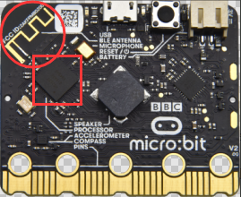

**( 1 )Project Description:**

The Micro: Bit main board V2 comes with a nRF52833 processor (with built-in
Bluetooth 5.1 BLE(Bluetooth Low Energy) device) and a 2.4GHz antenna for
Bluetooth wireless communication and 2.4GHz wireless communication. With the
help of them, the board is able to communicate with a variety of Bluetooth
devices, including smart phones and tablets.

In this project, we mainly concentrate on the Bluetooth wireless communication
function of this main board. Linked with Bluetooth, it can transmit code or
signals. To this end, we should connect an Apple device (a phone or an iPad) to
the board.

Since setting up Android phones to achieve wireless transmission is similar to
that of Apple devices, no need to illustrate again.

**( 2 ) Preparation**

\*Attachment of the Micro:bit main board V2 with your computer via the Micro USB
cable.

\*An Apple device (a phone or an iPad) or an Android device;

**( 3 ) Procedures:**

For Apple devices, enter this link
<https://www.microbit.org/get-started/user-guide/ble-ios/> with your computer
first, and then click “Download pairing HEX file”to download the Micro: Bit
firmware to a folder or desk, and upload the downloaded firmware to the Micro:
Bit main board V2.

Search “micro bit”in your App Store to download the APP micro:bit.

Connect your Apple device with Micro: Bit main board V2:

Firstly, turn on the Bluetooth of your Apple device and open the APP micro:bit
to select item “Choose micro:bit”to start pairing Bluetooth.

Please make sure that the Micro: Bit main board V2 and your computer are still
linked via the USB cable.

Secondly, click “Pair a new micro:bit”;

Following the instructions to press button A and B at the same time(do not
release them until you are told to) and press Reset & Power button for a few
seconds.

Release the Reset & Power button, you will see a password pattern shows on the
LED dot matrix. Now , release buttons A and B and click Next.

Set the password pattern on your Apple device as the same pattern showed on the
matrix and click Next.

Still click Next and a dialog box props up as shown below. Then click "Pair". A
few seconds later, the match is done and the LED dot matrix displays the "√"
pattern.

After the match with Bluetooth, write and upload code with the App.

Click “Create Code” to enter the programming page and write code.

Click  and the box
 appears, and then select “Create
√”.

Name the code as “1 “and click 
to save it.

Click the third item“Flash”to enter the uploading page. The default code program
for uploading is the one saved just now and named "1" and then click the other
"Flash" to upload the code program "1".

If the code is uploaded successfully a few seconds later, the App will emerge as
below and the LED dot matrix of the Micro: Bit main board V2 will exhibit a
heart pattern.

Projects below all conduct with the built-in sensors and the LED dot matrix
while the following ones will carry out with the help of external sensors.

**（Attention：to avoid burning the the Micro:bit main board V2, please remove
the USB cable and the external power from the board before fix it with a
T-shaped shield; likewise, the USB cable and the external power should be cut
from the main board before disconnect the shield from the board.)**

## Project 13: LED Blinks

**Overview**

The LED blink is one of the more basic experiments. In the above example use of
micro:bit, we have mentioned the 25 LED display of micro:bit. In this project,
you will learn how to control an LED blink using a keyestudio digital white LED
module and micro:bit sensor shield. Before testing, you should first turn off
the 5\*5 LED function of micro:bit.

**Components Required:**

-   Micro:bit main board\*1

-   Alligator Clip Cable\*3

-   USB Cable\*1

-   Keyestudio 1W LED Module (white)\*1

**Component Introduction:**

**About keyestudio 1W LED Module For BBC micro:bit (Black and Eco-friendly)**

This LED module is fully compatible with micro:bit control board. It will emit
the white light. The maximum operating current is 400mA, and the maximum power
is 1W. When using, connect the LED module to micro:bit control board using
Crocodile clip line.

There are total 6 rings on the module. Two G rings, two V rings and two S rings
are separately connected.

When using, G ring for ground; V for 3V; S for signal pin (0 1 2). When signal
end is HIGH, LED lights.

**Technical Parameters**

-   Working voltage: DC 3.0-3.3V

-   Working current: 400mA

-   Power: 1W

-   Light Color: white

-   Dimensions: 31mm\*27mm\*8mm

-   Weight: 2.4g

-   Environmental attributes: ROHS

**Connection Diagram**

Connect the keyestudio Digital LED Module to micro:bit main board with 3
Alligator clip cables. Ring S to P0, V to 3V, G to GND. Connect the micro:bit to
your computer with a micro USB cable.

**Coding**

So now let's move to coding. Let us see how we can code the LED flash. Below are
some steps to follow.

Open the
[https://makecode.micro:bit.org/\#editor](https://makecode.microbit.org/#editor)
to write your code.

Microsoft MakeCode is actually a platform that allows us to code for a
micro:bit, and also provides an interactive simulator where we can debug and run
our code, and will be able to see what to expect out right there on the site.

Go to MakeCode and choose **My Projects** and click on **New Projects**.

If you want to see the codes behind, then you can click on JavaScript and it
will display JavaScript code there in IDE.

**The following test code is for your reference:**

**Test Results**

Done wiring and powered up, send the code to micro:bit, you will see an LED
blink on the module, with an interval about one second.

## Project 14: LED Breathes

**Overview**

The light breath experiment is a little bit similar to the previous project.
This time we connect the keyestudio LED module to the main board. Connect the
Signal pin of LED module to P0 of micro:bit. From the Pinout diagram of
micro:bit, you can get the P0 can be used as Analog Pin.

This lesson you will learn how to control the brightness of LED on the module,
gradually becoming brighter and dimming, just like the LED is breathing.

**Components Required:**

-   Micro:bit main board\*1

-   Keyestudio Micro bit Sensor V2 Shield\*1

-   USB Cable\*1

-   keyestudio Digital LED Module\*1

-   Alligator Clip Cable\*3

**Component Introduction:**

**About Keyestudio Micro: bit Honeycomb Digital LED Module**

Keyestudio micro bit
honeycomb digital LED module is fully compatible with the micro:bit.

In the experiment, we connect it with the micro: bit by a crocodile clip. This
module contains 6 connectors: G, G, V, V, S and S.

G is GND, V is VCC, and S is the signal end of the module. Moreover, the red LED
of the module can simulate breathing effect by controlling the PWM output of S
end.

**Technical Parameters**

Working voltage: DC 3.0-5V  
Working current: 60mA  
Maximum power: 300mW  
Working temperature: -25 ℃ \~-65 ℃  
Size: 30mm \* 27mm \* 5mm  
Weight: 2.0g  
LED color: red  
Environmental attributes: ROHS

**Connection Diagram:**

Connect the keyestudio Digital LED Module to micro:bit main board with 3
Alligator clip cables. Ring S to P0, V to 3V, G to GND. Connect the micro:bit to
your computer with a micro USB cable.

**Coding**

So now let's move to coding. Let’s see how to code the LED to flash. Below are
some steps to follow.

Open the
[https://makecode.micro:bit.org/\#editor](https://makecode.microbit.org/#editor)
to write your code.

Microsoft MakeCode is actually a platform that allows us to code for a
micro:bit, and also provides an interactive simulator where we can debug and run
our code, and will be able to see what to expect out right there on the site.

Go to MakeCode and choose **My Projects** and click on **New Projects**.

If you want to see the codes behind, then you can click on JavaScript and it
will display JavaScript code there in IDE.

**The following test code is for your reference:**

**Test Results**

Done wiring and powered up, send the code to micro:bit, you should finally see
an LED on the module gradually become brighter, then gradually dim, circularly
just like the LED is breathing.

## Project 15: Blink and Breath

**Overview**

In this project, we combine the project 13 and project 14. You will learn how to
control the LED on the module blink for twice, then breath for twice,
circularly.

**Components Required:**

-   Micro:bit main board\*1

-   Keyestudio Micro bit Sensor V2 Shield\*1

-   USB Cable\*1

-   Keyestudio Digital LED Module\*1

-   Alligator Clip Cable\*3

**Connection Diagram**

Connect the keyestudio Digital LED Module to micro:bit main board with 3
Alligator clip cables. Ring S to P0, V to 3V, G to GND. Connect the micro:bit to
your computer with a micro USB cable.

**Coding**

So now let's move to coding. Let us see how to code the LED to blink and breath.
Below are some steps to follow.

Open the
[https://makecode.micro:bit.org/\#editor](https://makecode.microbit.org/#editor)
to write your code.

Microsoft MakeCode is actually a platform that allows us to code for a
micro:bit, and also provides an interactive simulator where we can debug and run
our code, and will be able to see what to expect out right there on the site.

Go to MakeCode and choose **My Projects** and click on **New Projects**.

If you want to see the codes behind, then you can click on JavaScript and it
will display JavaScript code there in IDE.

**The following test code is for your reference:**

**Test Results**

Done wiring and powered up, send the code to micro:bit, you should see the LED
on the module firstly blink twice, then breath twice, circularly.

## Project 16: Traffic Light

**Overview**

When walking at the crossroad, you can see the traffic light command the orderly
movement of pedestrians and vehicles. So how is the traffic light controlled to
operate? In this project, we will connect a traffic light module to our sensor
shield, controlling traffic light blink with micro:bit. You will learn how to
simulate the running of traffic light.

**Components Required:**

-   Micro:bit Main Board \*1

-   Keyestudio micro bit honeycomb Traffic Light Module\*1

-   Micro:bi USB Cable \*1

-   Alligator Clip Cable\*4

**Component Introduction:**

**About Traffic Light Module:**

The keyestudio micro bit
Honeycomb traffic light module is fully compatible with the micro bit control
board. In the experiment, we connect this module to the micro:bit control board
using crocodile clip wires. There are 6 ports on the module, including 3 GND
ports which are connected. The module comes with 3 LED lights in red, yellow and
green. We can control the 3 LEDs on and off on the module , and simulate the
roadside traffic lights flashing.

**Technical parameters**

-   Working voltage: DC 3.0-3.3V

-   Control port: digital port

-   Size: 42mm\*47mm\*12mm

-   Weight: 5.7g

-   Environmental attributes: ROHS

**Connection Diagram**

Connect the keyestudio Traffic Light Module to micro:bit main board with 4
alligator clip cables. Ring R to P0, Y to P1, G to P2 and GND to GND. Connect
the micro:bit to your computer with a micro USB cable.

**Coding**

So now let's move to coding. Below are some steps to follow.

Open the
[https://makecode.micro:bit.org/\#editor](https://makecode.microbit.org/#editor)
to write your code.

Microsoft MakeCode is actually a platform that allows us to code for a
micro:bit, and also provides an interactive simulator where we can debug and run
our code, and will be able to see what to expect out right there on the site.

Go to MakeCode and choose **My Projects** and click on **New Projects**.

If you want to see the codes behind, then you can click on JavaScript and it
will display JavaScript code there in IDE.

**The following test code is for your reference:**

**Test Results**

When wiring the main board up and powering it up and uploading the test code to
it, you will find the green LED on it lights up at 5s and then turns off,
followed by the yellow LED which flashes three times at 0.5s and then the red
LED is on at 5s. Repeat the sequence.

## Project 17: RGB

**Overview:**

Do you guys know what is more interesting than blinking eyes? It is use RGB LED
to change color.

Thus in this project, we will learn to create unique color combinations with the
help of RGB LED module.

**Components Required:**

-   Micro:bit Main Board \*1

-   Keyestudio micro bit honeycomb 5050RGB Module \*1

-   Micro:bit USB Cable \*1

-   Alligator Clip Cable\*4

**Component Introduction:**

**About keyestudio 5050 RGB Module For BBC micro:bit:**

This module mainly contains a 5050 RGB LED, fully compatible with micro:bit
control board.

When using, connect the RGB module to micro:bit control board using Crocodile
clip wires.

There are total 6 rings on the module. Note that three V rings are connected. V
ring for 3V; R, G and B ring is separately connected to signal pin (0 1 2) of
micro:bit main board.

When three signal pins are LOW, module will gradually show red, green and blue
light.

**Technical Parameters**

-   Working voltage: DC 3.0-3.3V

-   Control mode: active LOW(common anode)

-   Dimensions: 31mm\*27mm\*3mm

-   Weight: 1.8g

-   Environmental attributes: ROHS

**Connection Diagram**

Connect the keyestudio 5050 RGB Module to micro:bit main board with 4 alligator
clip cables. Ring B to P0, R to P1, G to GND, V to 3V.

Connect the micro:bit to your computer with a micro USB cable.

**Coding**

So now let's move to coding. Below are some steps to follow.

Open the
[https://makecode.micro:bit.org/\#editor](https://makecode.microbit.org/#editor)
to write your code.

Microsoft MakeCode is actually a platform that allows us to code for a
micro:bit, and also provides an interactive simulator where we can debug and run
our code, and will be able to see what to expect out right there on the site.

Go to MakeCode and choose **My Projects** and click on **New Projects**.

If you want to see the codes behind, then you can click on JavaScript and it
will display JavaScript code there in IDE.

**The following test code is for your reference:**

**Test Results:**

Connecting according to the diagram and uploading the test code to the main
board,you will notice that the LEDs of the RGB module flash in different colors.

## Project 18: Play Music

**Overview**

In this project, you will learn how to play music with keyestudio passive buzzer
module. We are going to conduct two experiments.

One is to directly control the High and Low level input of micro:bit P0 end
through setting two square waves so as to control the sound of the buzzer. The
other is to leverage the function of the software itself, inputting the square
waves of different frequencies and different lengths on the P0 end. Finally make
the buzzer module play the song "Ode to Joy".

(The input PIO port can only be P0, can not be other interfaces).

**Components Required:**

-   Micro:bit Main Board\*1

-   USB Cable\*1

-   keyestudio Passive Buzzer Module\*1

-   Alligator Clip Cable\*3

**Component Introduction:**

**About Passive Buzzer Module:**

This keyestudio
passive buzzer is fully compatible with micro:bit control board.

It is mainly composed of a passive buzzer without oscillation circuit. It cannot
be actuated by itself, but by external pulse frequencies.

Different frequencies produce different sounds. Even can code the melody of a
song.

There are total 6 rings on the module. Note that two G rings, two V rings and
two S rings are connected. G for ground; V for 3V; S for signal pin(0 1 2).

When using, connect the module to micro:bit control board using alligator clip
lines.

**Technical Parameters**

-   Working voltage: DC 3.0-3.3V

-   Output signal: Digital signal (square wave)

-   Dimensions: 31mm\*27mm\*4.5mm

-   Weight: 2.3g

-   Environmental attributes: ROHS

**Connection Diagram**

Connect the keyestudio Passive Buzzer Module to micro:bit main board with 4
alligator clip cables. Ring S to P0, V to 3V, G to GND. And then interface the
board with your computer.

**Coding**

So now let's move to coding. Below are some steps to follow.

Open the
[https://makecode.micro:bit.org/\#editor](https://makecode.microbit.org/#editor)
to write your code.

Microsoft MakeCode is actually a platform that allows us to code for a
micro:bit, and also provides an interactive simulator where we can debug and run
our code, and will be able to see what to expect out right there on the site.

Go to MakeCode and choose **My Projects** and click on **New Projects**.

If you want to see the codes behind, then you can click on JavaScript and it
will display JavaScript code there in IDE.

**The following 2 sets of code are for your reference:**

**Code 1:**

**Code 2:**

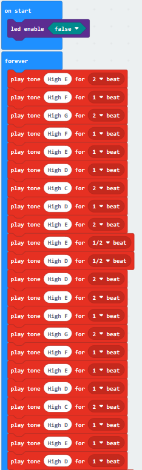

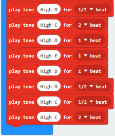

**Note:** on the MakeCode Block webpage, click the icon
, you can see the frequency of
each tone as follows.

**Test Results**

Done wiring and powered up, send the code 1 to micro:bit, you should hear two
sounds produced from passive buzzer circularly. If send the code 2 to micro:bit,
the buzzer will play the song Ode To Joy! Really amazing. Right? You can try to
change the tone to play other music.

## Project 19: Use Button to Control LED

**Overview**

When design the circuit, button switch is a commonly used component. The
micro:bit main board has three built-in buttons, however, sometimes still need
to use external button when design the circuit. So in this project, you will
learn how to use our push button module to control the LEDs on Keyestudio micro
bit honeycomb digital LED module.

**Component Required:**

-   Micro:bit Main Board\*1

-   Keyestudio Edge Connector IO Breakout Board for Micro:bit\*1

-   USB Cable\*1

-   keyestudio Digital Push Button\*1

-   keyestudio Digital White LED Module\*1

-   Alligator Clip Wires\*6

**Components Introduction:**

**About Keyestudio micro bit honeycomb tactile button module:**

This keyestudio
tactile button module is fully compatible with micro:bit control board. It
mainly uses a button element, which is a digital signal output device.

When using, connect the module to micro:bit control board using Crocodile clip
line.

There are total 6 rings on the module. Note that two G rings, two V rings and
two S rings are connected. G for ground; V for 3V; S for signal pin(0 1 2).

When press the button, the signal end of micro:bit main board will input HIGH
level signal.

**Technical Parameters**

-   Working voltage: DC 3.0-3.3V

-   Output Signal: Digital

-   Dimensions: 31mm\*27mm\*6.5mm

-   Weight: 1.8g

-   Environmental attributes: ROHS

**About Keyestudio Edge Connector IO Breakout Board for**

**Micro:bit**

The [BBC
micro:bit](http://microbit.org/guide/features/) is a powerful handheld, fully
programmable, computer designed by the BBC. It was designed to encourage
children to get actively involved in technical activities, like coding and
electronics. It supports the PXT graphical programming interface developed by
Microsoft and can be used under Windows, MacOS, iOS, Android and many other
operating systems without downloading additional compiler.

This breakout board has been designed to offer an easy way to connect additional
circuits and hardware to the edge connector on the BBC micro:bit. It provides an
easy way of connecting circuits using Alligator clip lines.

This edge connector offers access to a number of the BBC micro:bit processor
pins, such as power IO (input/output) interface, connection pins
P0、P1、P2、P3、P12、P13、P14、P15、P16、P19、P20 .

There are 2 kinds of power supply for the breakout board and micro:bit main
board.

1.  Direct to connect the battery case carried with batteries to micro:bit main
    board for powering;

2.  Connect the golden rings 3V GND with alligator clip lines for power supply;

The breakout board also comes with 4 fixed holes at the edge, easy to mount on
any other devices.

**Technical Parameters:**

-   Operating voltage: DC3.0-3.3V

-   Dimensions: 89mm\*33mm\*12mm

-   Weight:14.8g

**Connection Diagram:**

Attach the main board to Keyestudio Edge Connector IO Breakout Board for
Micro:bit;

Connect the keyestudio micro bit honeycomb tactile button module to the shield
with 3 Alligator clip cables;

Ring S to P0, V to 3V, and G to GND.

Connect the keyestudio micro bit digital LED module to the shield with 3
Alligator clip cables.

Ring S to P1, V to 3V, and G to GND.

Interface the micro:bit to your computer with a micro USB cable.

****

**Coding：**

So now let's move to coding. Below are some steps to follow.

Open the
[https://makecode.micro:bit.org/\#editor](https://makecode.microbit.org/#editor)
to write your code.

Microsoft MakeCode is actually a platform that allows us to code for a
micro:bit, and also provides an interactive simulator where we can debug and run
our code, and will be able to see what to expect out right there on the site.

Go to MakeCode and choose **My Projects** and click on **New Projects**.

If you want to see the code behind, then you can click on JavaScript and it will
display JavaScript code there in IDE.

**The following test code is for your reference:**

**Test Results:**

Wire according to connection diagram and upload the test code to the main board;

Open CoolTerm →click Options →click SerialPort to set COM port and baud rate
(set it to 115200)→click OK→click Connect;

When the button is pressed continuously, the CoolTerm serial port monitor
displays a number gradually increasing by 1, as shown in the figure below. At
the same time, press the button, the LED lights up; then press it again, the LED
goes out.

## Project 20: Use Tilt Sensor to Control LED

**Overview**

When design circuits, sometimes you will need to test whether an object is
tilted left or right, so in this case you can use our tilt sensor. In this
project, you will learn how to use our digital tilt sensor to control the LED.
At the same time, the LED dot matrix of Micro: bit and the CoolTerm serial port
monitor display the digital signal read by the vibration tilt module.

**Components Required:**

Micro:bit Main Board\*1

Keyestudio Edge Connector IO Breakout Board for Micro:bit\*1

USB Cable\*1

Keyestudio Digital Tilt Sensor\*1

Alligator Clip Wires\*6

keyestudio micro bit honeycomb 1W LED Module\*1

**Component Introduction:**

**About Keyestudio micro bit honeycomb vibration tilt module**

Keyestudio micro bit honeycomb vibration tilt module is fully
compatible with micro bit
control board.

In the experiment, we connect it with the micro: bit by a crocodile clip. There
are 6 sockets on it, 2 G, 2 V and 2 S, which are connected. Additionally, G is
GND, VV is VCC, and S is the signal end of the module.

Its function is to detect vibration and tilt. The SW-200D vibration switch
element adopted on this module is a ball type tilt induction unidirectional
trigger switch, one end of which is gold-plated(trigger end), another one is
silver-plated (conductive end).

When the module is in the horizontal position or inclined to the conductive end
(silver-plated), the switch element is in OFF state and the signal end outputs
the high level; when the module is tilted to the trigger terminal (gold-plated),
the switch element is ON state, and the signal terminal outputs the low level.
When the angle of the conductive end (silver-plated)is lower than 10 °
horizontally and the module is shaken by external force, so the trigger end
(gold-plated) will be in a short-time ON state, which makes the module detect
vibration.

**Technical Parameters:**

Working voltage: DC 3.3-5V  
Working current: 60mA  
Maximum power: 300mW  
Working temperature: -25 ℃ \~-65 ℃  
Size: 30mm \* 27mm \* 5mm  
Weight: 2.0g  
Environmental attributes: ROHS

**Connection Diagram**

Attach the main board to Keyestudio Edge Connector IO Breakout Board for
Micro:bit;

Connect the keyestudio micro bit honeycomb viberation tilt module to the shield
with 3 Alligator clip cables;

Ring S to P0, V to 3V, and G to GND.

Connect the keyestudio micro bit 1W LED module to the shield with 3 Alligator
clip cables.

Ring S to P1, V to 3V, and G to GND.

Interface the micro:bit to your computer with a micro USB cable.

****

**Coding**

So now let's move to coding. Below are some steps to follow.

Open the
[https://makecode.micro:bit.org/\#editor](https://makecode.microbit.org/#editor)
to write your code.

Microsoft MakeCode is actually a platform that allows us to code for a
micro:bit, and also provides an interactive simulator where we can debug and run
our code, and will be able to see what to expect out right there on the site.

Go to MakeCode and choose **My Projects** and click on **New Projects**.

If you want to see the codes behind, then you can click on JavaScript and it
will display JavaScript code there in IDE.

**The following test code is for your reference:**

Test Results

Wire according to connection diagram and upload the test code to the main board.

Open CoolTerm →click Options →click SerialPort to set COM port and baud rate
(set it to 115200)→click OK→click Connect.

When module tilts towards trigger end(gold-plated), both the LED dot matrix of
micro bit and the serial monitor display High Level(1) and the LED is on.
Otherwise, when module tilts towards conductive end(silver-plated), they both
show Low Level(0) and the LED turns off. The serial monitor of CoolTerm shows as
below.

## Project 21: Magnetic Detection

**Overview**

In this project, you will learn how to use our hall magnetic sensor to control
5\*5 LED of micro:bit display different images.

At the same time, both the LED dot matrix of Micro: bit and the CoolTerm serial
port monitor display the digital signals read by the Hall magnetic sensor to
detect whether the surrounding magnetic field exists.

**Components Required:**

-   Micro:bit Main Board\*1

-   Keyestudio Edge Connector IO Breakout Board for Micro:bit\*1

-   USB Cable\*1

-   Keyestudio Hall Magnetic Sensor\*1

-   Keyestudio micro bit honeycomb Digital LED Module\*1

-   Alligator Clip Wire\*6

**Component Introduction:**

**About Keyestudio micro bit honeycomb hall magnetic sensor**

The Keyestudio micro bit
honeycomb hall magnetic sensor is fully compatible with micro bit control board.
In the experiment, we connect it with the micro: bit by a crocodile clip. There
are 6 sockets on it, 2 G, 2 V and 2 S are connected. Additionally, G is GND, VV
is VCC, and S is the signal end of the module.

During the test, we test the analog value of S end via micro: bit control board.
The analog value reading is in Low Level(0) when the nearby magnetic field is
detected or it is in High Level(1).

**Technical Parameters:**

Working voltage: DC 3.0-5V  
Working current: 60mA  
Maximum power: 300mW  
Working temperature: -25 ℃ \~-65 ℃  
Dimension: 30mm \* 27mm \* 5mm  
Weight: 2.0g  
Environmental attributes: ROHS

**Connection Diagram:**

Attach the main board to Keyestudio Edge Connector IO Breakout Board for
Micro:bit;

Connect the keyestudio micro bit honeycomb hall magnetic sensor to the shield
with 3 Alligator clip cables;

Ring S to P0, V to 3V, and G to GND.

Connect the keyestudio micro bit digital LED module to the shield with 3
Alligator clip cables.

Ring S to P1, V to 3V, and G to GND.

Interface the micro:bit to your computer with a micro USB cable.

****

**Coding**

So now let's move to coding. Below are some steps to follow.

Open the
[https://makecode.micro:bit.org/\#editor](https://makecode.microbit.org/#editor)
to write your code.

Microsoft MakeCode is actually a platform that allows us to code for a
micro:bit, and also provides an interactive simulator where we can debug and run
our code, and will be able to see what to expect out right there on the site.

Go to MakeCode and choose **My Projects** and click on **New Projects**.

If you want to see the codes behind, then you can click on JavaScript and it
will display JavaScript code there in IDE.

**The following code is for your reference:**

**Test Results:**

Wire according to connection diagram and upload the test code successfully.

Open CoolTerm →click Options →click SerialPort to set COM port and set baud rate
to 115200→click OK→click Connect.

When the hall magnetic sensor detects magnetic field nearby, both the LED dot
matrix of micro bit and the serial monitor display Low Level(0) and the LED is
on. Otherwise, they both show High Level(1) and the LED turns off. The serial
monitor of CoolTerm shows as below.

## Project 22: Capacitive Touch

**Overview**

Are you tired of traditional buttons? Let’s have a try on capacitive touch ones.
In this project, we are going to replace the button switch with a capacitive
touch sensor. You will learn how to use Keyestudio touch sensor to control
active buzzer and how to read the digital signal(1/0) of the sensor on the
CoolTerm serial port monitor.

**Components Required:**

-   Micro:bit Main Board\*1

-   Keyestudio Micro bit Sensor V2 Shield\*1

-   USB Cable\*1

-   keyestudio Capacitive Touch Sensor\*1

-   keyestudio Digital Buzzer Module\*1

-   Alligator Clip Wire\*6

**Component Introduction:**

**About Keyestudio micro bit honeycomb capacitive touch module:**

This keyestudio
capacitive touch module is fully compatible with micro:bit control board. When
using, connect the module to micro:bit control board using Crocodile clip line.

It mainly uses touch detection IC, which is a digital signal output device.The
touch detection IC is designed to replace the traditional button with a variable
area key, featuring low power consumption and wide operating voltage.

When power on the module, it needs a stabilization time of about 0.5 sec. During
this time period, do not touch the keypad. At this time, all functions are
disabled, and self-calibration is always performed. No touching the key, the
recalibration period is about 4.0sec.

Capacitive touch sensors are used in many devices such as laptop trackpads,
digital audio players, computer displays, mobile phones, mobile devices, tablets
and others.

There are total 6 rings on the module. Note that two G rings, two V rings and
two S rings are separately connected. G for ground; V for 3V; S for signal pin(0
1 2).

When touch the sensing area, input HIGH level signal to micro:bit signal end,
LED on the module will turn on; or else, turn off.

**Technical Parameters**

-   Working voltage: DC 3.0-3.3V

-   Output Signal: Digital

-   Dimensions: 31mm\*27mm\*2.5mm

-   Weight: 1.7g

-   Environmental attributes: ROHS

**Connection Diagram:**

Attach the main board to Keyestudio Edge Connector IO Breakout Board for
Micro:bit;

Connect the keyestudio micro bit honeycomb capacitive touch sensor to the shield
with 3 Alligator clip cables;

Ring S to P1, V to 3V, and G to GND.

Connect the keyestudio micro bit passive buzzer module to the shield with 3
Alligator clip cables.

Ring S to P0, V to 3V, and G to GND.

Interface the micro:bit to your computer with a micro USB cable.

****

So now let's move to coding. Below are some steps to follow.

Open the
[https://makecode.micro:bit.org/\#editor](https://makecode.microbit.org/#editor)
to write your code.

Microsoft MakeCode is actually a platform that allows us to code for a
micro:bit, and also provides an interactive simulator where we can debug and run
our code, and will be able to see what to expect out right there on the site.

Go to MakeCode and choose **My Projects** and click on **New Projects**.

If you want to see the codes behind, then you can click on JavaScript and it
will display JavaScript code there in IDE.

**The following code is for your reference:**

**Test Results:**

Wire according to connection diagram and upload the test code to the main board.

Open CoolTerm →click Options →click SerialPort to set COM port and baud rate
(set it to 115200)→click OK→click Connect.

Touch the designated area of the capacitive touch sensor, the CoolTerm serial
port monitor displays number 1 and the passive buzzer makes sounds. Without
touching, the number on the monitor is 0 and the buzzer makes no sound.

## Project 23: Someone Comes

**Overview**

You may see such a lens in a film or television. When someone wants to attack a
target, but not close to the target, they were directly found and the alarm
sounded. When some special forces go to the target, they will be covered with
moist mud, so that they will not be discovered by the other party. Why ?

Originally, the human body will emit a certain wavelength of infrared rays of
about 10um. The relevant sensors are installed near the targets that are being
attacked to sense the infrared rays emitted by the human body and then alarm.
After the mud is applied, the sensors can not sense the infrared rays emitted by
the human body.

In this project, you will learn how to use a PIR motion sensor and micro:bit to
detect whether there is someone move nearby. Finally show the different images
on 25 LED matrix of micro:bit.

**Components Required:**

-   Micro:bit main board\*1

-   Keyestudio Edge Connector IO Breakout Board for Micro:bit \*1

-   USB Cable\*1

-   Keyestudio PIR Motion Sensor\*1

-   Keyestudio Digital Buzzer Module\*1

-   Alligator Clip Wire\*6

**Component Introduction:**

**About keyestudio micro bit honeycomb PIR Motion Sensor:**

This keyestudio PIR
motion module is fully compatible with micro:bit control board.When using,
connect the module to micro:bit control board using Crocodile clip line.

It is mainly composed of a digital pyroelectric infrared sensor, which is a
digital signal output device.

This sensor has built-in filters, strong anti-interference, low voltage and
micro power consumption.

The detection distance of the module is 3-5 meters.

The detection angle in the horizontal direction is less than 80°; the detection
angle in the vertical direction is less than 55°

There are total 6 rings on the module. Note that two G rings, two V rings and
two S rings are separately connected. G for ground; V for 3V; S for signal pin(0
1 2).

Once detecting someone moving nearby, the signal pin of micro:bit main board
will input HIGH level; LED on the module lights.

**Technical Parameters:**

-   Working voltage: DC 3.0-3.3V

-   Working current: 100mA

-   Maximum power: 0.5W

-   Output signal: digital signal

-   Detection distance: 3-5 meters

-   Detection angle: less than 80°in the horizontal direction and less than 55°
    in the vertical direction

-   Operating temperature range: -30℃\~ +80℃

-   Dimensions: 31mm\*27mm\*6mm

-   Weight: 2g

-   Environmental attributes: ROHS

**Connection Diagram:**

Attach the main board to Keyestudio Edge Connector IO Breakout Board for
Micro:bit;

Connect the keyestudio micro bit honeycomb PIR motion sensor to the shield with
3 Alligator clip cables;

Ring S to P1, V to 3V, and G to GND.

Connect the keyestudio micro bit passive buzzer to the shield with 3 Alligator
clip cables.

Ring S to P0, V to 3V, and G to GND.

Interface the micro:bit to your computer with a micro USB cable.

****

**Coding:**

So now let's move to coding. Below are some steps to follow.

Open the
[https://makecode.micro:bit.org/\#editor](https://makecode.microbit.org/#editor)
to write your code.

Microsoft MakeCode is actually a platform that allows us to code for a
micro:bit, and also provides an interactive simulator where we can debug and run
our code, and will be able to see what to expect out right there on the site.

Go to MakeCode and choose **My Projects** and click on **New Projects**.

If you want to see the codes behind, then you can click on JavaScript and it
will display JavaScript code there in IDE.

**The following code is for your reference:**

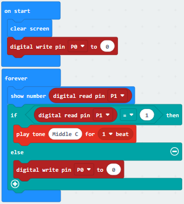

**Test Results:**

Wire according to connection diagram and upload the test code to the main board.

When the PIR motion sensor detects movement of human , the LED dot matrix shows
High Level(1) and the passive buzzer make noises; otherwise, the matrix displays
Low Level(0) and the buzzer makes no sound.

## Project 24: Light Brightness

**Overview**

It is seen that sensors are everywhere in our daily life. Some public street
lights automatically light up during the day and automatically go out at night.
Why?In fact, those lights make use of a photosensitive element that can measure
the brightness of external light.In the evening, when outside brightness becomes
lower, the street light is automatically controlled to be turned on.

In this project, you will learn how to use our keyestudio photocell sensor and
micro:bit to control the brightness of external light. Show the result on 5\*5
LED of micro:bit or serial monitor of CoolTerm software

**Components Required:**

-   Micro:bit Main Board\*1

-   Keyestudio Edge Connector IO Breakout Board for Micro:bit\*1

-   USB Cable\*1

-   keyestudio Photoresistor Sensor\*1

-   keyestudio Digital Red LED Module\*1

-   Alligator Clip Wire\*6

**Component Introduction:**

**About keyestudio micro bit honeycomb photoresistor :**

The Keyestudio micro bit honeycomb photoresistor is fully compatible with micro
bit control boards. In the experiment, we connect it with the micro: bit by a
crocodile clip. There are 6 connectors which are G, G, V, V, S and S

Additionally, G is GND, V is VCC, and S is the signal end of the module.

The sensor also includes a photoresistor whose resistance varies with ambient
lightness. The brighter the ambient environment is, the higher the resistance
is. Otherwise, the lower the resistance is. During the test, we test the analog
value of S end via a micro: bit board. The brighter the ambient environment is,
the larger the analog value becomes; and the darker the light is, the smaller
the analog value is.

**Technical Parameters:**

Working voltage: DC 3.0-5V  
Working current: 60mA  
Maximum power: 300mW  
Working temperature: -25 ℃ \~-65 ℃  
Dimension: 30mm \* 27mm \* 5mm  
Weight: 2.0g  
Environmental attributes: ROHS

**Connection Diagram:**

Attach the main board to Keyestudio Edge Connector IO Breakout Board for
Micro:bit;

Connect the keyestudio micro bit honeycomb PIR motion module to the shield with
3 Alligator clip cables;

Ring S to P0, V to 3V, and G to GND.

Connect the keyestudio micro bit passive buzzer to the shield with 3 Alligator
clip cables.

Ring S to P1, V to 3V, and G to GND.

Interface the micro:bit to your computer with a micro USB cable.

****

**Coding:**

So now let's move to coding. Below are some steps to follow.

Open the
[https://makecode.micro:bit.org/\#editor](https://makecode.microbit.org/#editor)
to write your code.

Microsoft MakeCode is actually a platform that allows us to code for a
micro:bit, and also provides an interactive simulator where we can debug and run
our code, and will be able to see what to expect out right there on the site.

Go to MakeCode and choose **My Projects** and click on **New Projects**.

If you want to see the codes behind, then you can click on JavaScript and it
will display JavaScript code there in IDE.

**The following test code is for your reference:**

**Test Results:**

Connect micro:bit to computer via USB cable and transfer code to micro:bit.

Open CoolTerm, click Options and select SerialPort, set COM port and baud
rate(115200). Click OK and Connect.

CoolTerm monitor shows the corresponding analog signal, with the light intensity
getting weaker, the analog value plummets gradually and red LED gets dimmer,
otherwise, the analog value grows and red becomes brighter.

## Project 25: Hear Footsteps

**Overview**

As for those corridor lights, when we walk through the corridor to make a sound,
the corridor light will automatically light up, after that, quiet down, the
lights are off. Why? Actually inside the lighting circuit, it has installed a
sound sensor. When detects the sound, light is turned on, or else LED off.

In this lesson, we connect an analog sound sensor to P0 of micro:bit, then
detect the outside sound via reading the analog value of P0.The greater the
external sound, the greater the analog value.You can see the analog value is
displayed on the micro:bit LED matrix, or check it from serial monitor of
CoolTerm software.

**Components Required:**

-   Micro:bit Main Board\*1

-   Keyestudio Edge Connector IO Breakout Board for Micro:bit\*1

-   USB Cable\*1

-   keyestudio Analog Sound Sensor\*1

-   keyestudio Digital Red LED Module\*1

-   Alligator Clip Wire\*6

**Component Introduction:**

**About Keyestudio micro bit honeycomb microphone module**

This keyestudio
microphone module is fully compatible with micro:bit control board. When using,
connect the module to micro:bit control board using Crocodile clip line.It is a
sound detection device, an analog signal output device.It is mainly composed of
a MIC head, a LM358D chip and a potentiometer.

When the microphone detects sound, and converts it into a voltage signal; then
amplifies it through the LM358D chip. The potentiometer is used to adjust the
signal amplification.

There are total 6 rings on the module. Note that two G rings, two V rings and
two S rings are separately connected. G for ground; V for 3V; S for signal pin(0
1 2).We can work out the sound volume by reading the analog value of signal end.

**Technical Parameters**

-   Working voltage: DC 3.0-3.3V

-   Output signal: Analog signal

-   Dimensions: 31mm\*27mm\*4mm

-   Weight: 2g

-   Environmental attributes: ROHS

**Connection Diagram:**

Attach the main board to Keyestudio Edge Connector IO Breakout Board for
Micro:bit;

Connect the keyestudio micro bit honeycomb sound sensor to the shield with 3
Alligator clip cables;

Ring S to P0, V to 3V, and G to GND.

Connect the keyestudio micro bit 1W LED module to the shield with 3 Alligator
clip cables.

Ring S to P1, V to 3V, and G to GND.

Interface the micro:bit to your computer with a micro USB cable.

****

**Coding**

So now let's move to coding. Below are some steps to follow.

Open the
[https://makecode.micro:bit.org/\#editor](https://makecode.microbit.org/#editor)
to write your code.

Microsoft MakeCode is actually a platform that allows us to code for a
micro:bit, and also provides an interactive simulator where we can debug and run
our code, and will be able to see what to expect out right there on the site.

Go to MakeCode and choose **My Projects** and click on **New Projects**.

If you want to see the codes behind, then you can click on JavaScript and it
will display JavaScript code there in IDE.

**The following test code is for your reference:**

**Test Results:**

Wire according to connection diagram and upload the test code to the main board.

Open CoolTerm →click Options →click SerialPort to set COM port and baud rate
(set it to 115200)→click OK→click Connect.

When ambient sound changes, these changes will be shown on the CoolTerm serial
port monitor, as shown below. The louder the sound, the bigger the analog value.
When the analog value of sound is bigger than 100, the LED lights up; when the
value is smaller than 100, the LED remains off.

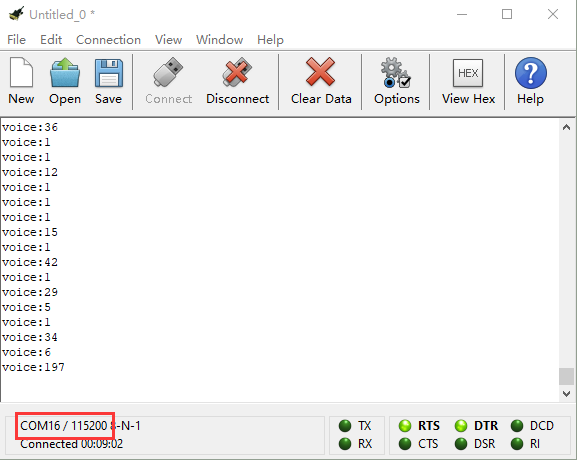

## Project 26: Ambient Light

**Overview**

This lesson is a little bit similar to the previous illumination test by a
photoresistor. But this time we will use keystudio TEMT6000 light sensor whose
sensitivity is better than a photoresistor. You will learn how to use a TEMT6000
sensor and micro:bit to test the ambient light. The analog value will show on
the micro:bit LED matrix or on the CoolTerm monitor.

**Components Required:**

-   Micro:bit Main Board\*1

-   USB Cable\*1

-   TEMT6000 Ambient Light Sensor\*1

-   Alligator Clip Wire\*3

**Component Introduction:**

**About keyestudio TEMT6000 Light Module For BBC micro:bit**

This keyestudio
TEMT6000 light module is fully compatible with micro:bit control board. When
using, connect the module to micro:bit control board using Crocodile clip line.

This module is mainly composed of a highly sensitive visible photocell (NPN
type) triode, which can magnify the captured tiny light illumination changes by
about 100 times, and is easily recognized by the microcontroller for AD
conversion.

Its response to visible light illumination is similar to that of the human eye,
so that can detect the intensity of ambient light.It is an analog signal output
device.

There are total 6 rings on the module. Note that two G rings, two V rings and
two S rings are connected. G for ground; V for 3V; S for signal pin(0 1 2).You
can use it to detect the ambient light intensity by reading the analog value of
signal pin.

**Technical Parameters**

-   Working voltage: DC 3.0-3.3V

-   Output Signal: Analog signal

-   Dimensions: 31mm\*27mm\*2.5mm

-   Weight: 1.7g

-   Environmental attributes: ROHS

**Connection Diagram**

Connect the keyestudio TEMT6000 Light Module to micro:bit main board with 3
Alligator clip cables. Ring S to P0, V to 3V, G to GND.Connect the micro:bit to
your computer with a micro USB cable.

So now let's move to coding. Below are some steps to follow.

Open the
[https://makecode.micro:bit.org/\#editor](https://makecode.microbit.org/#editor)
to write your code.

Microsoft MakeCode is actually a platform that allows us to code for a
micro:bit, and also provides an interactive simulator where we can debug and run
our code, and will be able to see what to expect out right there on the site.

Go to MakeCode and choose **My Projects** and click on **New Projects**.

If you want to see the codes behind, then you can click on JavaScript and it
will display JavaScript code there in IDE.

**The following test code is for your reference:**

**Test Results:**

Wire up components，plug in external power and transfer code to micro:bit. Open
CoolTerm, click Options and select SerialPort, set COM port and baud
rate(115200). Click OK and Connect.

The CoolTerm shows the light intensity，the stronger the light intensity, the
larger the analog value, as shown below:

## Project 27: Rotary Potentiometer

**Overview**

When we conduct DIY experiments, we often use the adjustable potentiometer,
which is also a 10K adjustable resistor in nature. In this experiment, the
Keyestudio Micro Bit Honeycomb rotary potentiometer is controlled by the P0 on
Micro: Bit main board. By rotating the potentiometer, the analog value data
changes, and the measured analog value is displayed on the CoolTerm serial port
monitor.At the same time, the brightness of LED connected to P1 interface also
gradually changes.

**Components Required:**

-   Micro:bit Main Board\*1

-   Keyestudio Edge Connector IO Breakout Board for Micro:bit\*1

-   USB Cable\*1

-   keyestudio Analog Rotation Sensor\*1

-   keyestudio Digital 1W LED Module\*1

-   Alligator Clip Wire\*6

**Component Introduction:**

**About Keyestudio micro bit honeycomb rotary potentiometer module**

The keyestudio micro bit
honeycomb rotary potentiometer module is fully compatible with micro bit control
board. In the experiment, we connect the module to the micro:bit control board
using crocodile clip wires. There are 6 ports on the module and those marked in
the same name are connected. To link it with the micro:bit control board, we
only need to connect 3 ports, that’s G to GND, V to 3V and S to a signal
port(port 0,1 or 3).

The module uses a 10K adjustable resistor. By rotating the potentiometer, we can
change the value of the resistor and then build a circuit to convert the
resistance change into the voltage change.

**Technical Parameters:**

-   Working voltage: DC 3.0-3.3V

-   Control port: analog port

-   Size: 25mm\*28mm\*26mm

-   Weight: 6.7g

-   Environmental attributes: ROHS

**Connection Diagram:**

Attach the main board to Keyestudio Edge Connector IO Breakout Board for
Micro:bit;

Connect the keyestudio micro bit honeycomb rotary potentiometer module to the
shield with 3 Alligator clip cables;

Ring S to P0, V to 3V, and G to GND.

Connect the keyestudio micro bit 1W LED module to the shield with 3 Alligator
clip cables.

Ring S to P1, V to 3V, and G to GND.

Interface the micro:bit to your computer with a micro USB cable.

**Coding:**

So now let's move to coding. Below are some steps to follow.

Open the
[https://makecode.micro:bit.org/\#editor](https://makecode.microbit.org/#editor)
to write your code.

Microsoft MakeCode is actually a platform that allows us to code for a
micro:bit, and also provides an interactive simulator where we can debug and run
our code, and will be able to see what to expect out right there on the site.

Go to MakeCode and choose **My Projects** and click on **New Projects**.

If you want to see the codes behind, then you can click on JavaScript and it
will display JavaScript code there in IDE.

**The following test code is for your reference:**

**Test Results**

Connect micro:bit to computer via USB cable and transfer code to micro:bit. Open
CoolTerm, click Options and select SerialPort, set COM port and baud
rate(115200). Click OK and Connect.

Adjust the potentiometer, when the analog value grows, red LED will become
brighter, on the contrary, the smaller the analog value is, the darker the red
LED gets.

## Project 28: Joystick

**Overview**

For some DIY projects, you perhaps use a component, that is, joystick module,
such as game joysticks. How could they operate?

In this lesson, you will learn how to control a joystick module and micro:bit
shield to display the data on serial monitor.

**Components Required:**

-   Micro:bit main board\*1

-   USB Cable\*1

-   keyestudio Joystick Module\*1

-   Alligator Clip Wire\*5

**Component Introduction:**

**About Keyestudio micro bit honeycomb PS2 joystick module:**

The keyestudio micro bit
Honeycomb PS2 joystick module is fully compatible with micro bit control board.
In the experiment, we connect the joystick module to the micro:bit control board
using crocodile clip wire. There are 6 ports on the module, of which two are GND
ports that are connected. When controlling it, we need to connect the VRx，VRy
port to the analog port of the micro:bit control board, and the SW port to the
digital port. We can judge the working state of the joystick on the module by
reading the two analog values and the levels (be low or high) of a digital port.

Attention: When testing the SW port function, for some products, we need to
connect a resistor to SW interface (connect to VCC port after connecting a
resistor), the port function is valid; otherwise SW port is invalid.

**Technical Parameters:**

-   Working voltage: DC 3.0-3.3V

-   Control port: analog port (VRx VRy) and digital port (SW)

-   Size: 40mm\*45mm\*31mm

-   Weight: 11.5g

-   Environmental attributes: ROHS

**Connection Diagram**

Connect the keyestudio micro bit honeycomb PS2 joystick to micro:bit main board
with 5 Alligator clip cables. Ring VRy to P1, VRx to P2, V to 3V and G to
GND.Connect the micro:bit to your computer with a micro USB cable.

****

So now let's move to coding. Below are some steps to follow.

Open the
[https://makecode.micro:bit.org/\#editor](https://makecode.microbit.org/#editor)
to write your code.

Microsoft MakeCode is actually a platform that allows us to code for a
micro:bit, and also provides an interactive simulator where we can debug and run
our code, and will be able to see what to expect out right there on the site.

Go to MakeCode and choose **My Projects** and click on **New Projects**.

If you want to see the codes behind, then you can click on JavaScript and it
will display JavaScript code there in IDE.

**The following test code is for your reference:**

**Test Results**

Wire up according to connection diagram. plug in external power and upload code
to micro:bit. Open CoolTerm, click Options and select SerialPort, set COM port
and baud rate(115200). Click OK and Connect.

If you operate the joystick, the analog value on X, Y and Z will change, as well
as pin B, as shown below:

## Project 29: Self Watering System for Your Plants

**Overview**

In life, you may often water some flowers and plants from time to time to
prevent them from withering, but not need to pour more. It may requires
experience. So can we make a system that allows the machine to automatically
water the plants’ soil when it is dry? Of course yes.

In this project, you will learn how to use a soil humidity sensor and micro:bit
to detect the humidity of your plants’ soil. Display the analog value on the
micro:bit LED matrix or on the serial monitor.

**Components Required:**

-   Micro:bit Main Board\*1

-   USB Cable\*1

-   keyestudio Soil Humidity Sensor\*1

-   Alligator Clip Wires\*3

**Component Introduction:**

**About Keyestudio micro bit honeycomb soil sensor**

The keyestudio micro bit
honeycomb soil humidity sensor is fully compatible with micro bit control board.
During the experiment, we connect the sensor to the micro:bit using crocodile
clip wire. With this sensor, we can make an automatic watering device.

There are three connectors on this sensor,namely connector G,V and S.when using,
we need to connect it the Micro:bit main board by ringing G to GND, V to 3V and
S to signal port(0, 1 or 2).

When you are not at home or forget to water your plants, it can sense if your
plant is thirsty.

**Technical Parameters:**

-   Working voltage: DC 3.0-3.3V

-   Control port: analog port

-   Size: 22mm\*59mm\*3mm

-   Weight: 2.5g

-   Environmental attributes: ROHS

**Connection Diagram**

Connect the keyestudio micro bit honeycomb soil sensor to micro:bit main board
with 3 Alligator clip cables. Ring G to GND, V to 3V and S to P0. Connect the
micro:bit to your computer with a micro USB cable.

So now let's move to coding. Below are some steps to follow.

Open the
[https://makecode.micro:bit.org/\#editor](https://makecode.microbit.org/#editor)
to write your code.

Microsoft MakeCode is actually a platform that allows us to code for a
micro:bit, and also provides an interactive simulator where we can debug and run
our code, and will be able to see what to expect out right there on the site.

Go to MakeCode and choose **My Projects** and click on **New Projects**.

If you want to see the codes behind, then you can click on JavaScript and it
will display JavaScript code there in IDE.

**The following test code is for your reference:**

**Test Results:**

Wire according to connection diagram and upload the test code to the main board.

Open CoolTerm →click Options →click SerialPort to set COM port and baud rate
(set it to 115200)→click OK→click Connect.

Insert the soil humidity sensor into the land and the analog value of the
humidity will be shown on the CoolTerm serial port monitor. And its value will
increase with the soil humidity.

## Project 30: Color Sensor

**Overview:**

Color sensor enjoys wide applications in areas covering magnet, sound, pressure,
temperature, displacement, acceleration, gyroscope, liquid level, torque,
photoacoustic, current and strain measurement of physical quantities, almost all
important fields related to economy, national defense and daily life. It
especially can safely and effectively used in bad environment and has solved
technical difficulties have existed in many industries for many years. Thus it
has a great market demand. In this project, we will combine the Keyestudio Micro
Bit Honeycomb TCS34725FN color sensor with the Micro: Bit main board to get a
better understanding of how to work the color sensor.

**Components Required:**

-   Micro:bit Main Board\*1

-   Keyestudio Edge Connector IO Breakout Board for Micro:bit\*1

-   USB Cable\*1

-   Keyestudio Micro Bit Honeycomb TCS34725FN Color Sensor\*1

-   Alligator Clip Wire\*4

**Component Introduction:**

**About Keyestudio micro bit honeycomb TCS34725FN Color Sensor:**

The core of the KeyeStudio Micro Bit Honeycomb TCS34725FN color sensor is the
AMS AG's TCS34725FN digital converter which provides digital output of the value
of red, green, blue (RGB) and clear light.The integrated infrared blocking
filter minimizes the infrared spectral component of the incident light and
allows accurate color measurements. It features high sensitivity, wide dynamic
range and infrared blocking filter. It can minimize IR and UV spectral component
effects to produce accurate color measurements. And with ambient light intensity
detection and maskable interrupt. It communicates through the I2C interface.

**Communication Protocol:**

As mentioned before it uses I2C communication with one data line and one clock
line.There are three types of signals in the transmitting process of the I2C
bus, namely the start signal, the end signal and the response signal.

Start signal: when SCL is at high level, SDA jumps from high level to low level
and starts to transmit data.

End signal: when SCL is at high level, SDA jumps from low level to high level,
ending data transmission.

Response signal: the receiving IC sends a specific low level pulse to the
sending IC after receiving 8bit data, indicating that the data has been received

**Technical Parameters:**

-   Working voltage: 3.3V/5V

-   Control chip: TCS34725FN

-   Logic voltage: 3.3V/5V

-   Communication port: I2C

-   Size: 27mm\*20mm

**Description about pins:**

| **Pins**  | **Description**                        |
|-----------|----------------------------------------|
| V（VCC）  | 3.3V/5V ; anode                        |
| G（GND ） | for power supply                       |
| SDA       | I2C data input                         |
| SCL       | I2C clock input                        |
| INT       | interrupt output                       |
| LED       | abbreviation for light-emitting diodes |

**Connection Diagram:**

Attach the main board to Keyestudio Micro bit Sensor V2 Shield.Then connect the
keyestudio micro bit honeycomb TCS34725FN color sensor to the shield with 4
Alligator clip cables. Ring G to GND, V to 3V, SDA to P20 and SCL to P19.
Connect the micro:bit to your computer with a micro USB cable.

So now let's move to coding. Below are some steps to follow.

Open the
[https://makecode.micro:bit.org/\#editor](https://makecode.microbit.org/#editor)
to write your code.

Microsoft MakeCode is actually a platform that allows us to code for a
micro:bit, and also provides an interactive simulator where we can debug and run
our code, and will be able to see what to expect out right there on the site.

Go to MakeCode and choose **My Projects** and click on **New Projects**.

If you want to see the codes behind, then you can click on JavaScript and it
will display JavaScript code there in IDE.

Use library files to set test code and add TCS34725 Color Sensor to the below
block:

Click the link <https://github.com/mworkfun/pxt-tcs34725> to download library as
shown below.

When the library of TCS34725 Color Sensor is installed successfully，the block
TCS34725 can be found in the editing area as shown below:

**The following test code is for your reference:**

**Test Results:**

Wire according to connection diagram and upload the test code to the main board.

Open CoolTerm →click Options →click SerialPort to set COM port and baud rate
(set it to 115200)→click OK→click Connect.

Put the keyestudio micro bit honeycomb TCS34725FN color sensor in front of
stuffs in different colors, the corresponding value of RGB will be shown on the
CoolTerm serial port monitor.

## Project 31: Use Button to Control Buzzer and RGB

**Overview:**

In the above project, we have introduced the tactile button module, the passive
buzzer module and the RGB module.Now, we combine these sensor modules to create
an interactive project. In this project, you will learn to play different tones
and emit different colors of light using the tactile button module.

**Components Required:**

-   Micro:bit Main Board\*1

-   Keyestudio Edge Connector IO Breakout Board for Micro:bit\*1

-   USB Cable\*1

-   keyestudio Passive Buzzer Module\*1

-   keyestudio Tactile Button Module\*1

-   keyestudio 5050RGB Module\*1

-   Alligator Clip Wire\*10

**Connection Diagram:**

Attach the main board to Keyestudio Edge Connector IO Breakout Board for
Micro:bit;

Connect the keyestudio micro bit honeycomb passive buzzer module to the shield
with 3 Alligator clip cables;

Ring S to P0, V to 3V, and G to GND.

For tactile button module,ring S to P2, V to 3V, and G to GND.

For RGB module,ring B to P1, R to P2, G to P3 and V to 3V.

So now let's move to coding. Below are some steps to follow.

Open the
[https://makecode.micro:bit.org/\#editor](https://makecode.microbit.org/#editor)
to write your code.

Microsoft MakeCode is actually a platform that allows us to code for a
micro:bit, and also provides an interactive simulator where we can debug and run
our code, and will be able to see what to expect out right there on the site.

Go to MakeCode and choose **My Projects** and click on **New Projects**.

If you want to see the codes behind, then you can click on JavaScript and it
will display JavaScript code there in IDE.

**The following test code is for your reference:**

**Test Results:**

Wire according to connection diagram and upload the test code to the main board.

Open CoolTerm →click Options →click SerialPort to set COM port and baud rate
(set it to 115200)→click OK→click Connect.

Touch the tactile button, the passive buzzer makes corresponding tone, the RGB
sensor emits corresponding color and the Cool Term shows the number.

## Project 32: Make A Tone

**Overview**

In the above projects, we’ve introduced passive buzzer module, TEMT6000 ambient
light sensor, soil humidity sensor and other sensors . We now combine those
sensor modules to make interactive projects.

In this project, you will learn how to make a buzzer play different tones based
on the measured analog value of both ambient light and microphone sound.

**Components Required:**

-   Micro:bit main board \*1

-   USB Cable \*1

-   Keyestudio Edge Connector IO Breakout Board for Micro:bit

-   Keyestudio Passive Buzzer Module for micro:bit \*1

-   Keyestudio TEMT6000 Light Module for micro:bit \*1

-   Keyestudio Soil Humidity Module for micro:bit \*1

-   Alligator Clip Cable \*9

**Connection Diagram:**

Attach the main board to Keyestudio Edge Connector IO Breakout Board for
Micro:bit;

Connect the three keyestudio micro bit honeycomb sensors/modules to the shield
with Alligator clip cables;

For passive buzzer module, ring S to P0, V to 3V, and G to GND.

For TEMT6000 ambient light module, ring S to P1, V to 3V, and G to GND.

For soil humidity module, ring S to P2, V to 3V, and G to GND.

**Coding:**

So now let's move to coding. Below are some steps to follow.

Open the
[https://makecode.micro:bit.org/\#editor](https://makecode.microbit.org/#editor)
to write your code.

Microsoft MakeCode is actually a platform that allows us to code for a
micro:bit, and also provides an interactive simulator where we can debug and run
our code, and will be able to see what to expect out right there on the site.

Go to MakeCode and choose **My Projects** and click on **New Projects**.

If you want to see the codes behind, then you can click on JavaScript and it
will display JavaScript code there in IDE.

**The following test code is for your reference:**

**Test Results:**

Wire according to connection diagram and upload the test code to the main board.

Open CoolTerm →click Options →click SerialPort to set COM port and baud rate
(set it to 115200)→click OK→click Connect.

CoolTerm serial port monitor displays the light intensity analog values read by
the TEMT6000 ambient light sensor (P1) to render the buzzer to make a sound.If
the simulated values of ambient light and soil moisture are both less than or
equal to 100, the buzzer will not sound;If the simulated value of ambient light
is greater than 100 and the simulated value of soil moisture is less than or
equal to 100, the buzzer will play bass B;When the simulated value of ambient
light is less than or equal to 100, and the simulated value of soil moisture is
greater than 100, the buzzer will play tenor D;When the simulated value of
ambient light and the simulated value of soil moisture are both greater than
100, the buzzer utters the high tone E.

# **7.Resources:**

Download related files: https://fs.keyestudio.com/KS4011

Keyestudio Official Website: [www.keyestudio.com](http://www.keyestudio.com)

Keyestudio Wiki website:
[wiki.keyestudio.com](https://wiki.keyestudio.com/Main_Page)

BBC micro:bit Pins:
[http://micro:bit.org/guide/hardware/pins/](http://microbit.org/guide/hardware/pins/%20)

BBC micro:bit website: [http://micro:bit.org/](%20http:/microbit.org/)

Micro:bit MakeCode Block Editor:
[https://makecode.micro:bit.org/](https://makecode.microbit.org/)

Meet micro:bit starter programming:
[http://micro:bit.org/guide/](http://microbit.org/guide/)

BBC micro:bit Features Guide:
[http://micro:bit.org/guide/features/](http://microbit.org/guide/features/)

BBC micro:bit Safety Warnings:
[http://micro:bit.org/guide/features/](http://microbit.org/guide/features/)

BBC micro:bit Quick Start Guide:
[http://micro:bit.org/guide/quick/](http://microbit.org/guide/quick/)

